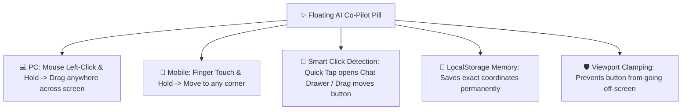

# 🤖 Complete Buyer's Guide & Manual: Floatable & Draggable AI Co-Pilot Assistant (`ai-copilot-drawer`)

> **Target Audience:** Pharmacy Owners, Managing Directors, Pharmacists, Tech-Savvy Operators, and Software Buyers.

---

## 🌟 1. Executive Summary: Your 24x7 Digital Pharmacy Advisor

Medical store chalate waqt aapke dimaag me hazaaron data queries ghoomti rehti hain:
- *"Aaj sham tak sabse zyada bikne wali dawa kon si thi?"*
- *"Distributor Mankind ka kul kitna payment due hai?"*
- *"Kya dukan me Amoxicillin ka koi alternative brand bacha hai?"*
- *"Agle 2 mahine me kitne rupaye ki medicines expire hone wali hain?"*

In sawalon ka jawab dhundhne ke liye aapko 5 alag-alag reports kholni padti hain, filter lagana padta hai, aur calculator lekar baithna padta hai.

**MedCare AI Co-Pilot** aapka apna **Intelligent Digital Pharmacist & Business Advisor** hai jo dukan ke live database ke sath 24x7 connected rehta hai. Aap isse aam bolchaal ki Hindi ya English me koi bhi sawal pooch sakte hain aur yeh 1 second me real-time accurate answer screen par lake deta hai! Sath hi iska **Floatable & Draggable UI** ise screen par kahin bhi smooth move karne ki azadi deta hai.

---

## 🖱️ 2. The Floatable & Draggable Floating Pill: How It Works

Screen par bottom-right me chamakta hua **`✨ AI Co-Pilot [Ctrl+J]`** pill button dikhta hai:

### 1. 💻 PC par Mouse se Drag & Move:
* AI button par **Left Click karke pakdein (Hold)** aur mouse se screen par jahan aapko convenient lage (Top, Bottom, Left, Right) drag karke chhod dein.

### 2. 📱 Mobile / Tablet par Touch se Move:
* Button par **Finger touch karke move karein**. Billing counter ya kisi important button ke aage se hata kar aasani se dusre kone par set kar dein.

### 3. 🎯 Click vs Drag Separation (No Accidental Opens):
* Agar aapne sirf **Click/Tap** kiya $\rightarrow$ AI Assistant drawer khul jayega.
* Agar aapne **Drag (pakad kar move)** kiya $\rightarrow$ Drawer nahi khulega, sirf button float hokar move hoga.

### 4. 💾 Position Memory (LocalStorage Persistence):
* Aapne button jahan bhi set kiya, browser us position (`x`, `y`) ko memory me save kar leta hai. Page refresh karne ya computer restart karne ke baad bhi button wahi milega!

---

## 💬 3. What Can You Ask Your AI Co-Pilot? (Real Prompts & Use Cases)

Aap niche diye gaye quick prompt buttons par click kar sakte hain ya apna sawal type kar sakte hain:

### 📊 Prompt 1: Sales & Live Profit Query
> **User:** *"Aaj ki total sales aur net profit kitna hua?"*
> **AI Co-Pilot:** *"Namaste Super Admin Bhai! 🙏 Aaj `MAIN-01` branch me ab tak **14 Invoices** kate hain. Gross Sales: **₹4,892.50**, aur aapka Shuddh Net Profit **₹1,124.80 (23.0% Margin)** bana hai! Cash drawer me is waqt **₹6,207.36** physical cash hona chahiye."*

---

### ⚠️ Prompt 2: Expiry Radar Query
> **User:** *"Show expiring medicines in next 60 days"*
> **AI Co-Pilot:** *"Agle 60 dino me aapki dukan ke **3 Batches** expire hone wale hain:*
> 1. `Augmentin 625 Duo` (Batch: AUG-01, Exp: 10/2026, Qty: 12 Strips) - Value: ₹1,920.00
> 2. `Pan-D Capsule` (Batch: PD-88, Exp: 11/2026, Qty: 8 Strips) - Value: ₹1,200.00
> *Recommendation: In batches ko distributor ko return karke credit note claim karein ya clearance discount par display karein."*

---

### 📦 Prompt 3: Total Stock Valuation Query
> **User:** *"Total inventory valuation across all branches"*
> **AI Co-Pilot:** *"Aapki dono branches ka total stock valuation:*
> - `MAIN-01 (Main Dispensary)`: 142 Active Batches | Purchase Value: **₹4,52,800.00** | MRP Value: **₹6,12,000.00**
> - `BRANCH-02 (Hospital Branch)`: 89 Active Batches | Purchase Value: **₹2,84,100.00** | MRP Value: **₹3,90,500.00**
> *Total Combined Stock Asset: **₹7,36,900.00**"*

---

## 🛡️ 4. Enterprise Security & Access Safeguards

* **Super Admin & Owner Exclusive:** AI Co-Pilot sensitive business metrics (profits, valuations, supplier debts) sirf authorized Super Admins aur Store Owners ko dikhata hai. Junior cashier login par yeh confidential data restrict rehta hai.
* **Grounded Real-Time Data:** AI hawa me baat nahi karta; yeh aapke live PostgreSQL database ke tables ko query karke 100% verified numbers deta hai.

---

## ❓ 5. Buyer FAQs

**Q1: Kya is AI ko use karne ke liye alag se internet subscription chahiye?**
* **Ans:** Isme standard Gemini / OpenAI API integration diya gaya hai jo Settings page se 1 click me configure ho jata hai.

**Q2: Keyboard se AI open karne ka shortcut kya hai?**
* **Ans:** Pure software me kahin bhi **`Ctrl+J`** (Mac par `Cmd+J`) dabayein, AI Co-Pilot drawer instant slide-in ho jata hai!
