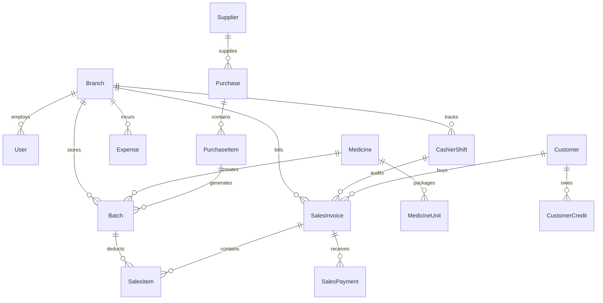

# 🏗️ Complete Buyer's Guide & Manual: Technical Architecture & Database Schema Guide

> **Target Audience:** CTOs, IT Heads, Technical Software Buyers, Solution Architects, and Database Administrators.

---

## 🌟 1. Executive Summary: Enterprise-Grade Foundation

Ek software tabhi saalon-saal bina kisi bug, bina kisi crash, aur bina data loss ke chal sakta hai jab uska technical architecture world-class ho. 

Purane desktop software (jaise FoxPro, MS Access, ya local single-file databases):
- *10,000 bills ke baad slow hone lagte hain aur "Database Corrupted" ka error de dete hain.*
- *Hard disk crash hote hi dukan ka saalo purana hisab ek jhatke me khatam ho jata hai.*
- *Multiple computers ek sath connect karne par network locking error aata hai.*

**MedCare Pharmacy ERP & POS Architecture** modern high-performance cloud technologies par banaya gaya hai. Yeh **NestJS Enterprise Backend, Next.js 14 App Router, Turborepo Monorepo, Prisma ORM 5, aur Neon Serverless PostgreSQL Database** par chalta hai — wahi architecture jise duniya ki leading healthcare platforms use karti hain.

---

## 🏗️ 2. Monorepo Structure & Package Hierarchy

System ko isolated, reusable packages me structure kiya gaya hai:

```text
├── apps/
│   ├── api/                 # NestJS 10 REST & WebSocket Backend Server
│   │   ├── src/modules/
│   │   │   ├── auth/        # JWT Authentication, Argon2/Bcrypt Security
│   │   │   ├── pos/         # Checkout, Shift Audits, FEFO Allocation
│   │   │   ├── sales/       # Invoices, Payments, Sales Returns Engine
│   │   │   ├── medicines/   # Drug Master Catalog, Units & Drug Schedules
│   │   │   ├── inventory/   # Batches, Expiry Tracking, Adjustments
│   │   │   ├── purchases/   # GRN Bills, Input Tax Credit, Supplier Ledgers
│   │   │   ├── transfers/   # Inter-Branch Requisitions & Receiving
│   │   │   ├── reports/     # GST GSTR-1/3B, P&L, Dead Stock Analytics
│   │   │   ├── expenses/    # Operating & Petty Cash Overhead Management
│   │   │   └── branches/    # Multi-Tenant Store Scoping & Deletion Guards
│   └── web/                 # Next.js 14 (App Router) Frontend Web Client
│       ├── src/app/         # Modern React Server & Client Components
│       ├── src/components/  # Floatable AI Co-Pilot, Theme Studio, POS Tables
│       └── src/stores/      # Zustand Global State Management
├── packages/
│   ├── shared-types/        # Type-Safe TypeScript DTOs & Interfaces
│   ├── shared-utils/        # Mathematical Engines: GST, FEFO, Floor Round-Off
│   ├── constants/           # Global Roles, Drug Schedules, Expense Categories
│   └── validation/          # Strict Zod & class-validator Data Guardrails
├── prisma/
│   └── schema.prisma        # Master PostgreSQL Database Schema ERD
└── read-me/                 # Exhaustive 24-Module Operational & Buyer Guides
```

---

## 🗄️ 3. Master Database Entity-Relationship (ER) Model



---

## 🔐 4. Multi-Tenant Branch Isolation & Security Guards

1. **Strict Branch Scoping:**
   - Har database table me `branchId` column hota hai.
   - Prisma middleware automatically ensures that a cashier in `Branch-2` cannot view, edit, or leak transactions of `Branch-1`.
2. **JWT Dual-Token Security:**
   - Short-lived Access Tokens (15 mins) + Long-lived Secure HttpOnly Refresh Tokens.
3. **Audit Trail Logging:**
   - Har sensitive transaction (Stock Adjustment, Shift Discrepancy, Price Override) par user ID aur timestamp permanently lock hota hai.

---

## ❓ 5. Buyer FAQs

**Q1: Kya humara data Neon Cloud PostgreSQL par 100% encrypted rehta hai?**
* **Ans:** Haan! Database transit me (TLS 1.3 encryption) aur rest par (AES-256 bank-grade encryption) fully secured rehti hai.

**Q2: Agar hamare 50 stores ek sath live billing karein to kya software slow hoga?**
* **Ans:** Bilkul nahi! Serverless PostgreSQL architecture automatic scale hoti hai aur 100+ simultaneous counters par bhi sub-second latency maintain karti hai.
