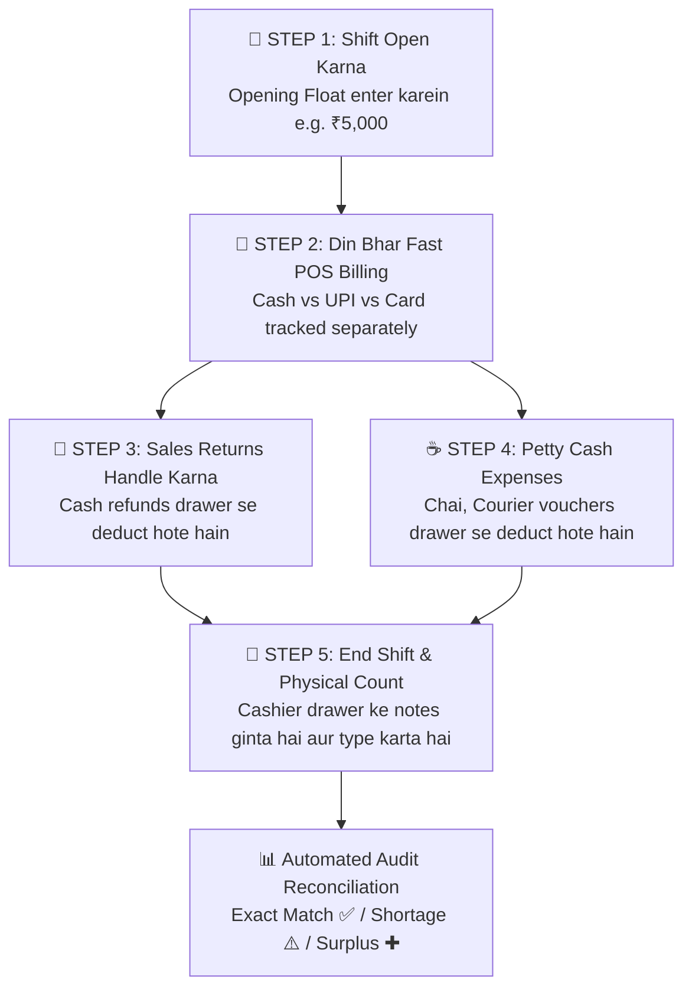

# 💵 Complete Buyer's Guide & Manual: Cash Register & Shift Float Management (`/cash-register`)

> **Target Audience:** Pharmacy Owners, Managing Directors, Head Cashiers, Store Auditors, and Software Buyers.

---

## 🌟 1. Executive Summary: The #1 Hidden Profit Leak in Pharmacies

Har medical store owner ka sabse bada dukh aur sir-dard hota hai: **"Counter se cash gayab hona ya sham ko galle ka hisab na milna."**

Ek aam pharmacy me:
- Subah dukan kholte waqt galle me chutta (Opening Cash Float) rakha hota hai (e.g. ₹3,000 ya ₹5,000).
- Din bhar me 100+ customers aate hain: Kuch cash dete hain, kuch GooglePay/PhonePe karte hain, kuch card swipe karte hain.
- Koi customer purani dawa wapas karke cash refund le jata hai.
- Dukan par aane wale distributor ke ladke ko chai/pani ka ₹150 drawer se nikal kar diya jata hai.
- Raat ko jab owner dukan band karta hai aur cash ginta hai, to **₹500 ya ₹1,000 ka hisab kam nikalta hai!**

Jab owner cashier se poochta hai, to cashier bolta hai: *"Sir maine to saara paisa drawer me hi dala tha, pata nahi kahan gaya."* Isse owner aur staff ke beech me mistrust paida hota hai.

**MedCare Cash Register & Shift Reconciliation Engine** is problem ko **hamesha ke liye 100% khatam** kar deta hai. Yeh software har ek cashier ki login se lekar logout tak ki shift ko ek digital safe ki tarah lock kar deta hai aur **1 paise ki bhi calculation discrepancy** ko turant pakad leta hai.

---

## 🔄 2. The 5-Step Shift Lifecycle (Subah Se Raat Tak)

---

## 🧮 3. The Unbreakable Golden Mathematical Formula

System backend me bina kisi human intervention ke is formula par chalta hai:

$$\mathbf{Expected\ Drawer\ Cash} = \text{Opening Float} + \text{Cash Sales} - \text{Cash Returns} - \text{Cash Expenses}$$

$$\mathbf{Cash\ Discrepancy} = \text{Physical Counted Cash} - \text{Expected Drawer Cash}$$

---

### 📊 Real Practical Case Study (Live Working Example):

Maan lijiye **Ramesh (Cashier)** ne subah 9:00 AM par shift start ki:

| Serial | Action / Transaction | Cash Flow Impact | Running Drawer Balance |
|---|---|---|---|
| **1.** | **Subah Opening Float Daala** | $+ ₹5,000.00$ | **₹5,000.00** |
| **2.** | **Cash Me 10 Bills Kate (Cash Sales)** | $+ ₹1,769.41$ | **₹6,769.41** |
| **3.** | **UPI Me 5 Bills Kate (PhonePe/GPay)** | $₹1,070.00$ *(Bank me gaya)* | **₹6,769.41** *(Drawer unchanged)* |
| **4.** | **Card Se 3 Bills Kate (POS Machine)** | $₹1,860.00$ *(Bank me gaya)* | **₹6,769.41** *(Drawer unchanged)* |
| **5.** | **Ek Customer Ne Dawa Wapas Ki (Cash Refund)** | $- ₹191.55$ | **₹6,577.86** |
| **6.** | **Dusre Customer Ne UPI Refund Liya** | $- ₹60.00$ *(Digital Refund)* | **₹6,577.86** *(Drawer unchanged)* |
| **7.** | **Staff Ki Chai & Snacks Diye (Petty Expense)** | $- ₹150.00$ | **₹6,427.86** |
| **8.** | **Medicine Parcel Courier Charges Diye** | $- ₹220.50$ | **₹6,207.36** |
| **🎯** | **SYSTEM EXPECTED CASH IN DRAWER** | **$= ₹6,207.36$** | **Galle me itna hona chahiye!** |

---

## ⚖️ 4. Shift Close & Physical Cash Count (Reconciliation Scenarios)

Raat ko 9:00 PM par Ramesh jab shift band karne ke liye **"Cashier Register & Shift"** modal kholta hai:
1. System usse bolta hai: *"Apne galle ke saare 500, 200, 100, 50, 20, 10 ke notes aur sikke gino aur total yahan likho."*
2. Ramesh ne drawer gina aur box me `₹6,207.36` enter kiya:

### 🟢 Scenario A: Exact Match ($\mathbf{₹0.00}$ Discrepancy)
* Physical Cash = ₹6,207.36 | Expected = ₹6,207.36
* Screen par **Bright Green Banner** aata hai:
  `✓ Exact Match - 100% Clean Shift Reconciliation. Zero Discrepancy!`
* Shift successfully close ho jati hai aur audit record ban jata hai.

### 🔴 Scenario B: Shortage / Paisa Kam Hona ($-$)
* Ramesh ne gina aur drawer me sirf **₹6,000.00** nikle (₹207.36 kam):
* Screen par **Red Alert Banner** aata hai:
  `⚠ Cash Shortage: -₹207.36 (Expected: ₹6,207.36 | Counted: ₹6,000.00)`
* Database me audit log lock ho jata hai ki Ramesh ki shift me ₹207.36 kam the. Owner agle din Ramesh ki salary ya incentive se adjust kar sakta hai.

### 🔵 Scenario C: Surplus / Paisa Jyada Hona ($+$)
* Drawer me **₹6,500.00** nikle (₹292.64 jyada):
* Screen par **Blue Alert Banner** aata hai:
  `✚ Cash Surplus: +₹292.64`
* Audit record me save hota hai ki extra cash kahan se aaya (jaise kisi customer ne change lene se mana kar diya).

---

## 👥 5. Multi-Cashier & Multi-Shift Support (Dukan Me 2-3 Staff Hone Par)

Agar aapki dukan subah 8 baje se raat 11 baje tak khulti hai aur 2 staff shift me kaam karte hain:
- **Morning Shift (8 AM - 3 PM):** Staff A login karta hai $\rightarrow$ ₹2,000 float daalta hai $\rightarrow$ 3 PM par apna hisab match karke shift band karta hai.
- **Evening Shift (3 PM - 11 PM):** Staff B login karta hai $\rightarrow$ Naya float daalta hai $\rightarrow$ 11 PM par apna independent hisab match karta hai.
- **Benefit:** Staff A aur Staff B ke hisab aapas me kabhi mix nahi hote!

---

## ❓ 6. Buyer FAQs

**Q1: Agar cashier din me shift band karna bhool jaye to kya hoga?**
* **Ans:** System automatic alert deta hai aur jab tak purani shift close nahi hoti, naya staff nayi shift start nahi kar sakta.

**Q2: Kya cashier system me expected cash ka number dekh kar cheating kar sakta hai?**
* **Ans:** Super Admin settings me **"Blind Shift Close"** enable kiya ja sakta hai jisme cashier ko screen par expected amount nahi dikhta — usko sach-sach physical cash gin kar type karna hota hai.

**Q3: Kya owner ghar baithe dekh sakta hai ki kis branch ke galle me kitna paisa hai?**
* **Ans:** Haan! Dashboard aur Super Admin panel par live cash float real-time update hota rehta hai.
