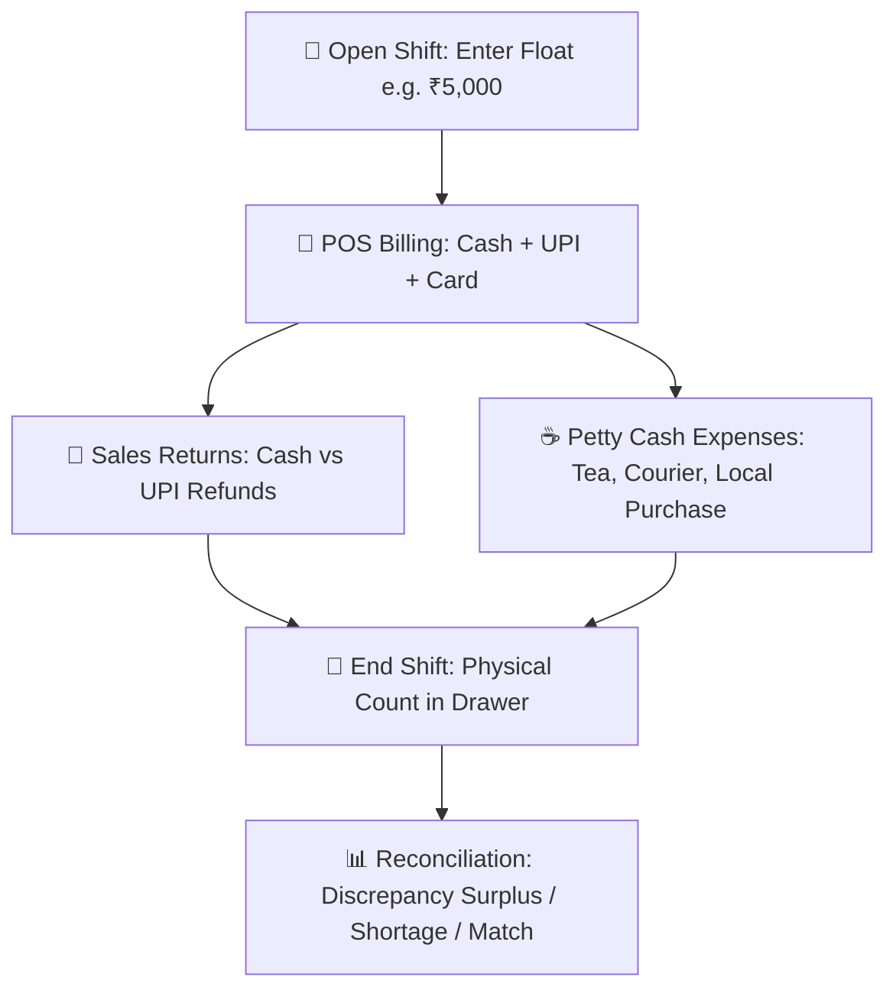

# 💵 Module Documentation: Cash Register & Shift Reconciliation (`/cash-register`)

---

## 🎯 1. Overview & Business Purpose
The **Cash Register & Shift Management** module tracks physical drawer cash from the moment a cashier logs in until they close their shift. It provides **100% mathematical audit precision** by tracking opening floats, cash sales, digital payments (UPI/Card), cash returns, and petty cash expenses.

---

## 🔄 2. Complete Shift Life-Cycle

---

## 🧮 3. The Golden Mathematical Formula

$$\mathbf{Expected\ Drawer\ Cash} = \text{Opening Float} + \text{Cash Sales} - \text{Cash Returns} - \text{Cash Expenses}$$

$$\mathbf{Cash\ Discrepancy} = \text{Physical Counted Cash} - \text{Expected Drawer Cash}$$

### Real Example:
| Metric | Amount | Description |
|---|---|---|
| **Opening Float** | $+₹5,000.00$ | Subah ka initial change |
| **Cash Sales** | $+₹1,769.41$ | 12 Cash Invoices |
| **Cash Returns** | $-₹191.55$ | Customer cash refunds |
| **Cash Expenses** | $-₹370.50$ | Tea & courier petty vouchers |
| **🎯 Expected Cash** | **$= ₹6,207.36$** | Drawer me hona chahiye |
| **Physical Counted** | $₹6,207.36$ | Actual drawer count |
| **Discrepancy** | $\mathbf{₹0.00}$ | Exact Match ✅ |

---

## 🛡️ 4. Discrepancy Statuses
1. **Exact Match ($\mathbf{₹0.00}$)**: Green banner (`No Discrepancy`).
2. **Shortage (Negative $\mathbf{-}$)**: Red alert banner indicating missing cash.
3. **Surplus (Positive $\mathbf{+}$)**: Blue alert banner indicating excess cash.

---

## 📡 5. Backend Endpoints & Database Tables

* `POST /api/pos/open-shift`: Creates `CashierShift` with `status: OPEN` and `openingCash`.
* `GET /api/pos/current-shift`: Queries `getShiftSummary()` for active shift.
* `POST /api/pos/close-shift`: Closes shift, records `closingCash`, `expectedCash`, and `cashDifference`.
* **Prisma Model**: `CashierShift` (`openedAt`, `closedAt`, `openingCash`, `closingCash`, `expectedCash`, `cashDifference`, `totalCashSales`, `totalUpiSales`, `totalCardSales`).
