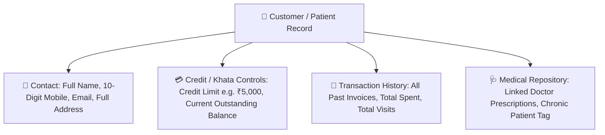

# 👤 Complete Buyer's Guide & Manual: Customers & Patient Credit (Khata) Management (`/customers`)

> **Target Audience:** Pharmacy Owners, Front-Desk Cashiers, Patient Relationship Managers, and Software Buyers.

---

## 🌟 1. Executive Summary: Patient Loyalty & Safe Credit (Khata) Control

Medical store par 70% business **Regular Patients aur Chronic Disease Customers** (Diabetes, Blood Pressure, Heart, Asthma) se aata hai jo har mahine 1 tareekh se 5 tareekh ke beech ₹2,000 se ₹5,000 ki dawaiyan kharidte hain.

Lekin in regular customers ko handle karne me 2 badi samasyayein aati hain:
1. **Udhar (Credit) Ka Phasna:** Customer bolta hai *"Bhaiya abhi pension/salary nahi aayi, khate me likh lo agle hafte de dunga."* Agar ye hisab copy/dairy me likha ho to aksar paise doob jate hain ya customer hisab par jhagda karta hai.
2. **Purani Dawa Ka Prescription Na Milna:** Doctor ne 6 mahine pehle patient ko kon si dose di thi, customer ko yaad nahi rehta aur wo bolta hai: *"Pichle baar jo blue color ki goli di thi wahi de do."*

**MedCare Customers & Patient Directory Module** aapki pharmacy ko ek corporate-grade patient management system me badal deta hai. Yeh har customer ka mobile-linked profile, complete purchase history, Schedule H prescription repository, aur **automated credit limit enforcement** provide karta hai.

---

## 📋 2. Customer Profile Attributes & Data Structure

---

## 💳 3. How the Automated Credit (Khata) Management Works

MedCare me har regular customer ko ek **`creditLimit`** assign ki ja sakti hai:

### Live Working Flow:
1. **Patient Profile Setup:**
   - Name: `Sharma Ji (Retired Govt Officer)`
   - Mobile: `9812345678`
   - Credit Limit: `₹5,000.00`
   - Current Balance: `₹0.00`

2. **First Credit Purchase (POS Billing):**
   - Sharma Ji ne ₹1,800 ki monthly dawaiyan li.
   - Cashier ne Payment Mode: **`CREDIT`** select kiya.
   - System check karta hai: $₹0 + ₹1,800 \le ₹5,000$ $\implies$ **Approved!**
   - Invoice generate hoti hai aur Sharma Ji ke profile me `currentBalance = ₹1,800.00` ho jata hai.

3. **Second Credit Purchase (Limit Cross Alert):**
   - 15 din baad Sharma Ji ke bete ne ₹3,500 ki dawaiyan mangi udhar par.
   - Naya total balance hoga: $₹1,800 + ₹3,500 = \mathbf{₹5,300.00}$.
   - System cashier screen par **Red Alert Pop-up** show karta hai:
     `⚠ Credit Limit Exceeded! Max Limit: ₹5,000 | Attempted Total: ₹5,300`
   - Cashier bina Super Admin password ke bill nahi bana sakta. Isse dukan ka udhar paisa doobne se 100% bach jata hai!

---

## 💵 4. Recording Customer Repayments (Khata Settlement)

Jab Sharma Ji dukan par aakar bolte hain: *"Bhaiya mere khate me se ₹1,500 jama kar lo"*:
1. Cashier Customer page par unka number search karta hai.
2. **"Receive Payment"** button dabata hai.
3. Amount: `₹1,500.00` aur Payment Mode (`CASH` ya `UPI`) select karta hai.
4. Save karte hi:
   - Sharma Ji ka outstanding balance ₹1,800 se ghat kar **₹300.00** reh jata hai.
   - Agar Cash mila, to cashier shift drawer me ₹1,500 automatic jud jata hai.
   - Sharma Ji ke phone par WhatsApp receipt chali jati hai: *"Aapka ₹1,500 payment receive ho gaya hai. Baki bacha balance: ₹300.00"*.

---

## 🩺 5. Chronic Disease & Prescription History Lookup

* Jab koi patient counter par aata hai aur bolta hai: *"Meri pichle mahine wali dawaiyan repeat kar do"*:
* Cashier customer profile me jakar **"Repeat Previous Bill"** dabata hai.
* System pichle bill ki saari dawaiyan automatically cart me load kar deta hai (FEFO fresh batches ke sath!). Counter par 1 minute ka kaam 5 second me ho jata hai!

---

## ❓ 6. Buyer FAQs

**Q1: Kya hum credit customer ko payment reminder bhej sakte hain?**
* **Ans:** Haan! Customer list se 1-click me WhatsApp payment reminder link khulta hai jisme unka total due balance aur pharmacy ka UPI QR code chala jata hai.

**Q2: Kya walk-in customer ka phone number lena mandatory hai?**
* **Ans:** Nahi. OTC sales ke liye default `Walk-in Customer` profile rehti hai. Sirf Schedule H items aur credit sales ke liye customer record jaruri hota hai.
