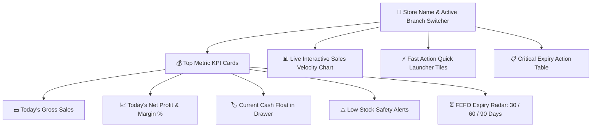

# 📊 Complete Buyer's Guide & Manual: Central Command Dashboard (`/`)

> **Target Audience:** Pharmacy Store Owners, Retail Medical Shop Chains, Hospital Dispensary Directors, and Non-Technical Software Buyers.

---

## 🌟 1. Executive Summary & Why You Need This Dashboard

Running a retail medical store or a multi-branch pharmacy is one of the most fast-paced, high-risk retail businesses in the world. As a pharmacy owner, you face critical daily questions:
- *Aaj subah se kitne rupaye ki bikri hui aur usme mera shuddh munafa (Net Profit) kitna bana?*
- *Meri dukan me aesi kon si dawaiyan hain jo agle 30 se 60 dino me expire hone wali hain aur mujhe unhe distributor ko return karna hai ya discount me bechna hai?*
- *Mere counter par baithe cashier ke galle (Cash Drawer) me is waqt kitna physical cash hona chahiye?*
- *Meri dukan ki sabse jyada bikne wali dawaiyan (Fast Moving Items) khatam to nahi hone wali?*

Agar aap traditional register ya purane desktop software par kaam karte hain, to in 4 sawalon ka jawab nikalne me aapko ghanto calculation karni padti hai. **MedCare Central Command Dashboard** aapko dukan kholte hi screen par ek single glance me ye saari jaankari live update karke deta hai. Isse aap bina kisi technical knowledge ke apni dukan ke har ek paise aur har ek tablet par 100% control rakh sakte hain.

---

## 🖥️ 2. Visual Walkthrough: Screen Par Kya-Kya Dikhta Hai?

Jab aap software open karte hain, to aapke samne ek neat, clean aur modern control center khulta hai. Niche har ek card aur section ka detail explanation diya gaya hai:

### 1. Active Branch Selector (Multi-Store Switcher)
* **Location:** Screen ke top-left header par.
* **Kyu banaya gaya hai:** Agar aapki ek se jyada dukanein hain (jaise `MAIN-01 · Main Dispensary` aur `BRANCH-02 · City Hospital Branch`), to Super Admin bina logout kiye ek click me kisi bhi branch ka data live switch karke dekh sakta hai.
* **Kaise kaam karta hai:** Dropdown par click karein $\rightarrow$ Dusri branch select karein $\rightarrow$ Pura dashboard turant us nayi branch ke live metrics me transform ho jata hai.

---

### 2. Top Metric Cards (Key Performance Indicators)

#### A. 💵 Today's Gross Sales (Aaj Ki Kul Bikri)
* **Kya dikhata hai:** Subah dukan khulne se lekar is second tak POS par kitne total rupaye ka bill kata hai.
* **Extra Data:** Kul kitne bills (invoices) kate hain aur kal ke mukable aaj bikri kitne percent ($+\%$ ya $-\%$) upar ya niche hai.
* **Buyer Value:** Aapko din bhar cashier se baar-baar poochne ki jarurat nahi ki kitna bika.

#### B. 📈 Today's Net Profit & Real Margin % (Shuddh Munafa)
* **Kya dikhata hai:** Yeh is software ka sabse powerful feature hai. Jyadatar software sirf sales dikhate hain, profit nahi. MedCare POS har ek bechi gayi dawa ki actual batch purchase cost ko selling price se minus karta hai, usme se invoice discount aur din ke kharche (petty cash) ko nikal kar aapka **real net cash profit** screen par live dikhata hai.
* **Profit Margin %:** Example ke liye agar aaj ₹10,000 ki sale hui aur ₹2,200 ka net munafa bana, to margin dikhayega `22.0%`.

#### C. 🏷️ Live Cash Float in Drawer (Galle Ka Cash)
* **Kya dikhata hai:** Counter par jo cashier baitha hai, uske cash box me is waqt kitne physical notes aur sikke hone chahiye.
* **Logic:** $\text{Subah ka cash (Opening Float)} + \text{Din me aayi Cash Sales} - \text{Customer ko wapas kiya Cash Refund} - \text{Dukan ki Chai/Courier Kharcha}$.
* **Buyer Value:** Cashier ki chori ya hisab me gadbadi ka darr 100% khatam ho jata hai.

#### D. ⚠️ Low Stock Triggers (Khatam Hone Wali Dawaiyan)
* **Kya dikhata hai:** Kitni dawaiyan apni Reorder Level (Safety Limit) se niche aa chuki hain.
* **Action:** Is card par click karte hi wo saari medicines ek list me aa jati hain jinka Purchase Order (PO) banana jaruri hai.

#### E. ⏳ FEFO Expiry Radar (Expiry Alert Center)
* **Kya dikhata hai:** Agle 30 din, 60 din, aur 90 din ke andar expire hone wale batches ki sankhya aur unki kul kharid keemat (Financial Valuation).
* **Buyer Value:** Pharmacy me sabse bada nuksan medicine expire hone se hota hai. Yeh radar aapko 2-3 mahine pehle alert kar deta hai taki aap ya to distributor ko dawa return karke credit note le sakein ya doctor se consult karke unhe pehle nikal sakein.

---

## ⚡ 3. Fast Action Tiles (Ek-Click Quick Launchers)

Dashboard ke right side me fast access buttons diye gaye hain taki staff ko menu me dhundhna na pade:
1. **`[F9] Fast POS Billing`**: Turant billing counter open karta hai.
2. **`[Alt+S] Receive Purchase GRN`**: Distributor se aayi nayi dawaiyo ka stock chadane ka form kholta hai.
3. **`[Alt+M] Add Medicine Master`**: Nayi medicine ka record add karta hai.
4. **`[Alt+R] Open Cashier Shift Register`**: Subah ka float enter karke shift start karta hai.

---

## 🧮 4. Mathematical Formulas & Business Logic

Dashboard par aane wale har ek number ke piche transparent, error-free mathematical calculations kaam karti hain:

### 1. Gross Sales Formula:
$$\text{Today Gross Sales} = \sum_{i=1}^{n} \text{SalesInvoice.totalAmount} \quad (\text{Where } \text{status} \neq \text{'CANCELLED'})$$

### 2. Today's Net Profit Formula:
$$\text{Today Net Profit} = \sum \Big( (\text{Selling Rate} - \text{Batch Purchase Price}) \times \text{Sold Qty} \Big) - \text{Total Discounts} - \text{Today Operating Expenses}$$

### 3. Live Expected Drawer Cash:
$$\text{Live Drawer Cash} = \text{Opening Float} + \text{Total Cash Sales} - \text{Total Cash Refunds} - \text{Cash Expenses}$$

---

## 🛡️ 5. Common Pharmacy Mistakes Jo Yeh Dashboard Rokta Hai

1. **Expiring Batches Ka Pata Na Chalna:**
   * *Traditional Software:* Expiry date dukan me tab pata chalti hai jab customer expired strip wapas lekar aata hai (Dukan ki badnami aur Drug Inspector ka fine).
   * *MedCare Dashboard:* Expiry hone se 90 din pehle yellow/red badge me dashboard par samne dikhata hai.
2. **Cashier Se Cash Missing Hona:**
   * *Traditional Software:* Raat ko dukan band karte waqt samajh nahi aata ki ₹500 kam kyu nikle.
   * *MedCare Dashboard:* Subah se sham tak ke har 1 paise ka continuous cash float monitor karta hai.
3. **Profit Ka Sirf Andaza Lagana:**
   * *Traditional Software:* Mahine ke aakhiri me pata chalta hai ki dukan munafey me thi ya nuksan me.
   * *MedCare Dashboard:* Har 1 minute me aapka live net profit screen par dikhata hai.

---

## ❓ 6. Buyer FAQs (Aamtaur Par Pooche Jaane Wale Sawaal)

**Q1: Kya dashboard dekhne ke liye mujhe accounting aani chahiye?**
* **Ans:** Bilkul nahi! Yeh dashboard aam medical store owner ke liye design kiya gaya hai jisme plain Hindi/English me bade-bade numbers aur green/red indicators se sab kuch clear hota hai.

**Q2: Agar mere paas 3 alag-alag stores hain to kya main ek jagah baith kar teeno ka live hisab dekh sakta hoon?**
* **Ans:** Haan! Super Admin Control panel se aap chahe dukan par ho ya ghar par mobile/laptop se kisi bhi branch ko select karke live sales aur cash drawer dekh sakte hain.

**Q3: Kya staff ko mera profit aur kharcha dikhega?**
* **Ans:** Nahi. Role-Based Access Control (RBAC) ke zariye Cashier aur Billing Staff ke liye Profit aur Owner Analytics automatic hide ho jata hai. Sirf Admin aur Store Owner ko hi profit dikhta hai.
