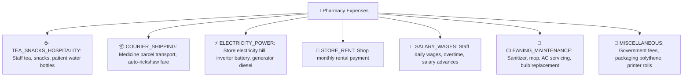

# ☕ Complete Buyer's Guide & Manual: Daily Expenses & Petty Cash Management (`/expenses`)

> **Target Audience:** Pharmacy Owners, Cashiers, Store Accountants, and Software Buyers.

---

## 🌟 1. Executive Summary: Tracking the Hidden Leaks in Pharmacy Profits

Dukan par har roz chote-mote kharche hote hain:
- *Subah cleaning aur jhadu-pocha wale ko ₹100 diye.*
- *Staff aur delivery boy ke liye ₹150 ki chai-samosa mangwaya.*
- *Medicine parcel lane wale tempo/courier ko ₹250 diye.*
- *Mahine ke aakhiri me Bijli ka bill (₹8,500) aur dukan ka Rent (₹25,000) diya gaya.*

Jab ye kharche galle (cash register) se nikal kar diye jate hain bina kisi digital record ke:
- *Sham ko galle me cash kam nikalta hai aur cashier bolta hai "Sir wo courier wale ko diya tha."*
- *Mahine ke end me store owner ko lagta hai ki ₹50,000 ka munafa hona chahiye tha, lekin jeb me sirf ₹20,000 bache hain! Kyunki ₹30,000 chote-chote kharchon me gayab ho gaye jinka koi hisab nahi tha.*

**MedCare Daily Expenses & Petty Cash Module** aapki dukan ke har ek rupaye ke kharche ko discipline aur accuracy ke sath track karta hai. Galle se nikalne wala har 1 rupaya automatically active cashier shift ke expected cash me se deduct hota hai aur P&L (Profit & Loss) statement me record ho jata hai.

---

## 🏷️ 2. Pre-Configured Expense Categories

Kharche ko sahi tarike se organize karne ke liye MedCare me ready-made categories hain:

---

## 💰 3. Cash Drawer vs Bank Payment Distinction

Yeh is module ka sabse mahatvapurna rule hai jo aapke cash register ko 100% accurate banata hai:

### Rule 1: Payment Method = `CASH` (Galle Se Diya)
* **Real Meaning:** Cashier ne dukan ke physical cash drawer se nikal kar ₹200 courier wale ko diye.
* **System Action:** Yeh ₹200 turant active cashier shift ke **`expectedCash`** me se minus ho jata hai!
* **Shift Close Impact:** Raat ko jab cashier cash ginega, to system usse ₹200 kam expect karega aur zero discrepancy aayegi.

### Rule 2: Payment Method = `UPI` / `BANK_TRANSFER` (Online Diya)
* **Real Meaning:** Store owner ne apne personal phone se GooglePay/PhonePe kiya ya bank account se NEFT kiya (jaise Bijli ka bill ₹5,000).
* **System Action:** Yeh kharcha P&L report me to count hoga, **lekin physical cash drawer ko bilkul touch nahi karega**!

---

## 🧮 4. Monthly Expense Analytics & P&L Impact

System har mahine ke kharchon ka category-wise visual pie chart aur summary table banata hai:
- *Chai & Nashta:* ₹4,500 (12%)
- *Courier & Transport:* ₹3,200 (9%)
- *Bijli & Diesel:* ₹8,000 (22%)
- *Staff Advances:* ₹12,000 (33%)
- *Miscellaneous:* ₹8,500 (24%)

**Net Profit Calculation:**
$$\mathbf{Store\ Net\ Cash\ Profit} = \text{Gross Sales Margin} - \mathbf{Total\ Monthly\ Expenses}$$

---

## ❓ 5. Buyer FAQs

**Q1: Kya staff galti se jhoota kharcha daal kar cash chori kar sakta hai?**
* **Ans:** Har expense entry par entry karne wale staff ka user ID, exact time, aur compulsory **"Notes / Reason"** field mandatory hota hai. Super Admin kisi bhi sandigdh entry ko inspect aur audit kar sakta hai.

**Q2: Kya hum expense ki receipt photo attach kar sakte hain?**
* **Ans:** Haan! Expense entry karte waqt aap courier slip ya electricity bill ki photo camera ya gallery se upload karke attach kar sakte hain.
