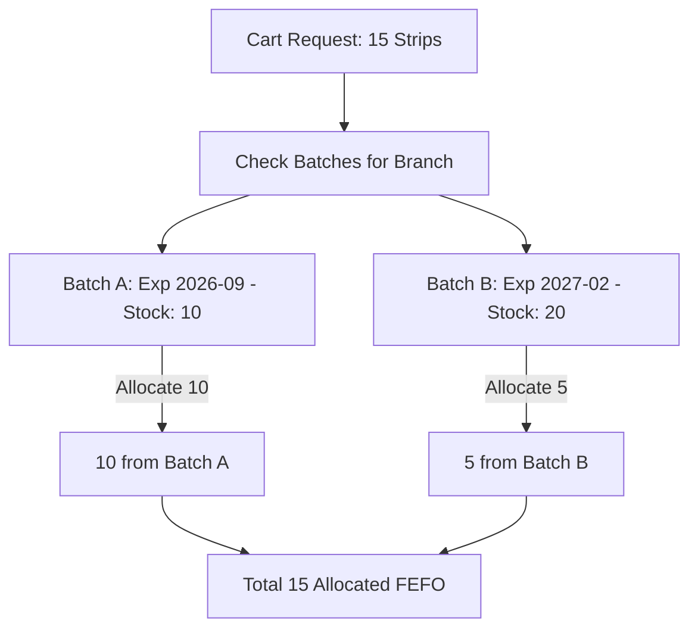

# 📦 Module Documentation: Inventory Batches & FEFO Engine (`/inventory`)

---

## 🎯 1. Overview & Business Purpose
The **Inventory Batches** module provides real-time, branch-isolated stock management. It implements an automated **FEFO (First-Expiry-First-Out)** engine that ensures older batches are sold first to eliminate stock expiry loss.

---

## ⏳ 2. FEFO Algorithm & Automated Allocation

When an item is added to the POS cart:
1. System queries all `ACTIVE` batches for that medicine in the current branch where `currentQty > 0` and `expiryDate > TODAY`.
2. Batches are sorted ascending by `expiryDate` ($\text{Earliest Expiry First}$).
3. If requested quantity exceeds Batch 1, the engine automatically allocates from Batch 2 and Batch 3 seamlessly.

---

## 🏷️ 3. Batch Attributes & Statuses

* **`currentQty`**: Available sellable stock in drawer/shelf.
* **`reservedQty`**: Stock held in active cart/pending transfers.
* **`damagedQty`**: Quarantined broken/damaged medicines.
* **`expiredQty`**: Expired stock locked from sales.
* **Status**: `ACTIVE`, `QUARANTINED`, `DEPLETED`, `EXPIRED`.

---

## 🛠️ 4. Manual Stock Adjustment & Audit
Pharmacists can perform physical stock audits:
* **Add Stock (Surplus Found)**: Creates positive `StockAdjustment`.
* **Deduct Stock (Breakage/Theft)**: Creates negative `StockAdjustment` with mandatory reason audit.

---

## 📡 5. Backend Endpoints & Database Tables

* `GET /api/inventory/batches`: Query batches with expiry radar filters (`30_days`, `60_days`, `expired`).
* `POST /api/inventory/adjustments`: Post physical count adjustment.
* **Prisma Models**: `Batch`, `StockMovement`, `StockAdjustment`.
