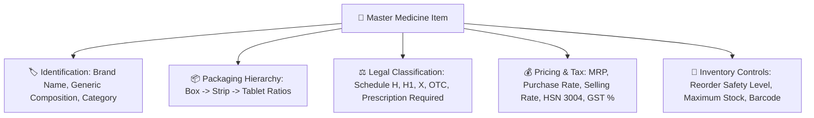

# 💊 Complete Buyer's Guide & Manual: Master Medicine Catalog & Drug Management (`/medicines`)

> **Target Audience:** Pharmacy Owners, Senior Pharmacists, Purchasing Heads, Regulatory Compliance Officers, and Software Buyers.

---

## 🌟 1. Executive Summary: The Foundation of Your Pharmacy ERP

Ek retail medical store ya chain pharmacy me 5,000 se lekar 25,000 alag-alag brand ki dawaiyan, syrups, injections, cosmetics, aur surgical items hote hain. 

Ek galat entry pure business ko barbad kar sakti hai:
- *Dolo 650 ki jagah par agar galti se rate ya packaging galat feed ho gaya to har sale par loss hoga.*
- *Agar generic composition (salt name) save nahi hai, to customer ko substitute dawa suggest nahi ki ja sakti aur customer bina dawa liye laut jata hai.*
- *Agar HSN code ya GST slab (5%, 12%, 18%) galat hai, to GST tax audit me bhari penalty lag sakti hai.*
- *Agar Schedule H / H1 / X classification nahi hai, to Drug Inspector ke raid me pharmacy ka license cancel ho sakta hai.*

**MedCare Master Medicine Catalog** aapki pharmacy ka central drug database hai. Isme Bharat ke drug laws, multi-level unit packaging, HSN codes, aur generic formulations ko seamlessly bind kiya gaya hai.

---

## 📋 2. Core Drug Fields & Data Structure (Har Dawa Ki Complete Profile)

Jab aap nayi medicine add ya edit karte hain, to system me ye saare attributes save hote hain:

---

### Detailed Attribute Breakdown:

| Field Name | Description & Importance | Real-World Example |
|---|---|---|
| **Medicine Name** | Commercial Brand / Trade Name | `Augmentin 625 Duo Tablet` |
| **Generic Name (Salt)** | Chemical formulation for substitute lookup | `Amoxicillin (500mg) + Clavulanic Acid (125mg)` |
| **Category & Sub-Category** | Therapeutic group for reporting | `Antibiotics` $\rightarrow$ `Penicillins` |
| **Manufacturer** | Drug manufacturing pharma company | `GlaxoSmithKline Pharmaceuticals Ltd (GSK)` |
| **HSN Code** | GST tax classification code | `30049099` (Standard 12% GST) |
| **Drug Schedule** | Legal schedule under Drugs & Cosmetics Act | `Schedule H` (Prescription mandatory) |
| **Prescription Required** | System flag for POS cashier guard | `true` (Triggers Doctor Rx modal) |
| **Base Selling Unit** | Smallest indivisible physical unit | `TABLET` or `ML` or `VIAL` or `CAPSULE` |
| **Strips Per Box** | Packaging Level 2 | `10` Strips per Outer Box |
| **Tablets Per Strip** | Packaging Level 1 | `10` Tablets per Foil Strip |
| **MRP** | Maximum Retail Price allowed by law | `₹223.50` |
| **Default Selling Rate** | Store standard discount selling rate | `₹200.00` |
| **Default Purchase Cost** | Wholesale distributor landing cost | `₹158.00` |
| **Reorder Safety Level** | Alert threshold when stock goes low | `50 Tablets` (Auto PO trigger) |
| **Barcode** | EAN-13 / Code-128 barcode number | `890103038291` |

---

## 🔄 3. Smart Multi-Level Packaging Unit Math

Retail medical stores me sabse jyada galti stock feeding aur unit rates calculate karne me hoti hai. MedCare ERP is calculation ko automatic solve karta hai:

### Golden Formula:
$$\text{Total Base Units (Tablets) in 1 Box} = \text{Strips Per Box} \times \text{Tablets Per Strip}$$

### Practical Example (Augmentin 625 Duo):
- 1 Box me 10 Strips hain.
- 1 Strip me 10 Tablets hain.
- Pura 1 Box = $10 \times 10 = \mathbf{100\ Tablets}$.

#### POS Price Mapping:
1. Agar 1 Box ki MRP ₹2,000 hai:
   - **1 Tablet ki MRP** = $\frac{2000}{100} = \mathbf{₹20.00}$
   - **1 Strip (10 Tablets) ki MRP** = $20 \times 10 = \mathbf{₹200.00}$
   - **1 Box (100 Tablets) ki MRP** = $\mathbf{₹2,000.00}$
2. Cashier chahe 1 tablet beche ya 10 box, software inventory ko exact number of tablets me deduct karta hai aur kabhi stock mismatch nahi hota!

---

## ⚖️ 4. Drug Schedules & Regulatory Compliance (Schedule H / H1 / X)

Bharat ke Drug Laws ke mutabiq dawaiyo ko 4 categories me classify kiya gaya hai:
1. **OTC (Over The Counter):** Paracetamol, Cough Lozenges, Antacids (Bina prescription becha ja sakta hai).
2. **Schedule H:** Antibiotics, Anti-hypertensives (Doctor prescription record mandatory).
3. **Schedule H1:** 3rd/4th generation antibiotics, anti-TB drugs, habit-forming sedatives (Special Separate Register & Doctor Reg No mandatory).
4. **Schedule X:** Narcotics, Psychotropic substances (Strict locked register & monthly reporting).

**MedCare Feature:** Medicine add karte waqt aap jaise hi Schedule choose karte hain, POS billing ke dauran software automatically cashier ko alert karta hai aur bina doctor ke naam aur MCI number ke bill complete nahi karne deta!

---

## 🔍 5. Generic Substitute Search (Save Lost Sales!)

Aapki dukan par customer aaya aur usne manga: *"Bhaiya Crocin 650 de do."* Lekin aapke paas Crocin 650 khatam hai.
* **Traditional Store:** Cashier bol deta hai *"Nahi hai bhaiya"* aur customer dusri dukan par chala jata hai (Sale lost).
* **MedCare POS:** Cashier search me `Paracetamol 650mg` dekhta hai $\rightarrow$ System screen par turant dukan me available same generic salt ke dusre brands dikha deta hai:
  - `Dolo 650 Tablet` (Stock: 120 Strips)
  - `Calpol 650 Tablet` (Stock: 45 Strips)
  - `Pacimol 650 Tablet` (Stock: 30 Strips)
* Cashier customer ko bolta hai: *"Sir Crocin ka hi same salt Dolo 650 available hai, ye le lijiye."* Aur sale save ho jati hai!

---

## ❓ 6. Buyer FAQs

**Q1: Kya hum 10,000 medicines ek sath Excel sheet se upload kar sakte hain?**
* **Ans:** Haan! Humare `/import` module me ready Excel template hai jisme aap apni saari medicines ek click me bulk import kar sakte hain.

**Q2: Agar kisi dawa ki MRP change ho jaye to kya purana stock ka rate bhi badal jayega?**
* **Ans:** Nahi! MedCare batch-wise inventory maintain karta hai. Agar purane batch ki MRP ₹50 thi aur naye batch ki MRP ₹55 hai, to purana batch ₹50 me hi bikega aur naya batch ₹55 me!

**Q3: Kya hum medicine me barcode print kar sakte hain?**
* **Ans:** Haan, master medicine page se 1-click me custom barcode labels standard barcode sticker printer par print ho jate hain.
