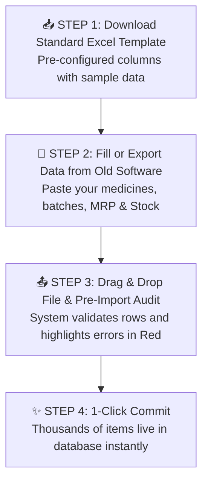

# 📥 Complete Buyer's Guide & Manual: Opening/Closing Stock & Bulk Data Import (`/import`)

> **Target Audience:** Pharmacy Owners, Migration Specialists, Store Onboarding Managers, and Software Buyers.

---

## 🌟 1. Executive Summary: Moving to a New Software in 1 Hour!

Naya pharmacy software kharidne me dukan owner ka sabse bada darr hota hai: **"Data Entry Ka Pahad!"**

- Dukan me 10,000 medicines rakhi hain.
- Agar ek-ek karke hath se type karenge to pura 1 mahina lag jayega aur dukan ka kaam thap ho jayega.
- Purane software (jaise Marg, Busy, Tally ya Excel) se naye software me data kaise aayega?

**MedCare Opening / Closing Stock & Bulk Import Engine** is onboarding headache ko hamesha ke liye khatam kar deta hai. Yeh engine standard **Excel (.xlsx) aur CSV files** ko 1 click me scan karta hai, saari medicines, generic formulations, HSN codes, batches, expiry dates, rates aur opening stock quantities ko **kuch hi seconds me import** kar deta hai.

---

## 📊 2. The 3-Step Bulk Import Process

---

## 📑 3. Master Excel Template Column Schema

Template me standard columns define kiye gaye hain jinme aap apna data paste kar sakte hain:

| Column Header | Data Type & Format | Required? | Example Value |
|---|---|---|---|
| **`MedicineName`** | Text (Brand Name) | **Mandatory** | `Telma 40mg Tablet` |
| **`GenericName`** | Text (Active Composition) | Optional | `Telmisartan (40mg)` |
| **`Category`** | Text (Therapeutic Group) | Optional | `Cardiovascular / Blood Pressure` |
| **`Manufacturer`** | Text (Pharma Company) | Optional | `Glenmark Pharmaceuticals Ltd` |
| **`HSNCode`** | Text (GST Code) | **Mandatory** | `30049099` |
| **`DrugSchedule`** | `SCHEDULE_H` / `OTC` | **Mandatory** | `SCHEDULE_H` |
| **`BaseUnit`** | `TABLET` / `ML` / `VIAL` | **Mandatory** | `TABLET` |
| **`StripsPerBox`** | Number | **Mandatory** | `10` |
| **`TabletsPerStrip`** | Number | **Mandatory** | `15` |
| **`BatchNumber`** | Text (Unique per batch) | **Mandatory** | `TEL-2026-X1` |
| **`ExpiryDate`** | `YYYY-MM-DD` ya `MM/YY` | **Mandatory** | `2028-06-30` |
| **`MRP`** | Decimal (₹) | **Mandatory** | `₹215.00` |
| **`SellingPrice`** | Decimal (₹) | **Mandatory** | `₹195.00` |
| **`PurchasePrice`** | Decimal (₹) | **Mandatory** | `₹150.00` |
| **`GSTPercent`** | Number (0, 5, 12, 18) | **Mandatory** | `12` |
| **`OpeningStockQty`** | Number (Base Units) | **Mandatory** | `150 (Total Tablets)` |

---

## 🛡️ 4. Intelligent Pre-Import Data Validation (Error Protection)

Jab aap Excel upload karte hain, to MedCare system database me commit karne se pehle **Dry-Run Validation** karta hai:

1. **Expiry Date Validation:**
   - Agar kisi row me expiry date galat format me hai ya purani beeti hui date hai, to system us row ko **Red Highlight** karke error message dikhata hai: `Row 42: Invalid Expiry Date`.
2. **Rate Logic Validation:**
   - System check karta hai: $\text{Purchase Price} \le \text{Selling Price} \le \text{MRP}$.
   - Agar Purchase Price MRP se jyada dali gayi hai, to alert karta hai.
3. **Duplicate Prevention:**
   - Ek hi file me agar same batch do baar aa gaya, to system unki opening quantities ko smart merge kar leta hai.

---

## ⚖️ 5. Physical Stock Audit & Closing Stock Finalization

Har financial year ke end par (31st March) ya monthly stock audit ke time:
* Store owner closing stock sheet export karta hai.
* Physical counter count se match karta hai.
* System automatically opening balance adjustments calculate karke naye financial year ke liye opening stock ledger prepare kar deta hai.

---

## ❓ 6. Buyer FAQs

**Q1: Hum Marg ya Busy software use karte hain, kya humara data isme aa jayega?**
* **Ans:** Haan! Marg ya Busy se "Item List with Batch" Excel me export karein aur humare template me copy-paste karke upload kar dein.

**Q2: Agar file me 5,000 rows me se sirf 2 rows me galti hai to kya pura upload fail ho jayega?**
* **Ans:** Nahi! System aapko option deta hai: "Skip 2 invalid rows and import 4,998 valid rows" ya fir wahi screen par 2 errors ko edit karke pura import karein.
