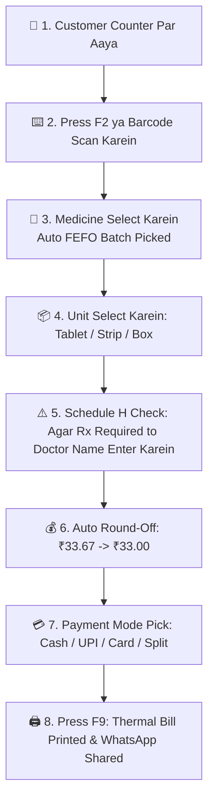

# 🛒 Complete Buyer's Guide & Manual: High-Speed POS Billing Counter (`/pos`)

> **Target Audience:** Medical Store Owners, Pharmacists, Cashiers, Billing Operators, and Non-Technical Software Buyers.

---

## 🌟 1. Executive Summary & Why You Need This POS

Retail pharmacy counter par subah se lekar raat tak sabse busy samay tab hota hai jab counter par 5-10 customers ek sath line me khade hote hain. Aise samay par agar software slow ho, mouse se baar-baar 10 alag jagah click karna pade, ya batch select karne me time lage, to customer irritate hokar dusri dukan par chala jata hai.

**MedCare High-Speed POS Billing** ko Bharat ke retail medical stores ki practical needs ko dhyan me rakh kar banaya gaya hai:
- **100% Keyboard Driven (Zero Mouse Dependency):** `F2` se search, `+ / -` se quantity, `F9` se checkout — 5 second ke andar pura bill print!
- **Automatic FEFO Stock Allocation:** Expiry date dhyan me rakhne ki tension khatam. Software purane batch ko automatically pehle select karta hai.
- **Smart Unit Conversion (Box / Strip / Tablet):** 1 khuli goli bechni ho, 1 pura patta bechna ho, ya 1 pura dabba — rates aur stock automatic calculate hote hain.
- **Schedule H Drug Compliance:** Antibiotics ya restricted dawaiyo par doctor ke naam ka mandatory guard.
- **Automated Round-Off System:** Customer ko chutta (coins) lene-dene ki jhanjhat se mukti (e.g. ₹33.67 $\rightarrow$ ₹33.00).
- **Split Multi-Mode Payments:** Aadha Cash, Aadha GooglePay/PhonePe aur baki Udhar (Credit).
- **Thermal & A4 GST Invoices:** 2-inch/3-inch thermal slip aur hospital A4/A5 GST bills instant print.

---

## 🖥️ 2. Step-by-Step Billing Workflow (From Customer Arrival to Bill Print)

---

## ⌨️ 3. Full Keyboard Shortcuts Master Table

Pharmacy counter par fast kaam karne ke liye mouse ki jagah in shortcuts ka use karein:

| Shortcut Key | Function Name | Screen Action & Real Use-Case |
|---|---|---|
| **`F2`** | Search Medicine | Search box me cursor le jata hai. Dawa ka naam ya barcode type karein. |
| **`F3`** | Switch Batch / Expiry | Agar customer ko koi specific batch chahiye to batch list kholta hai. |
| **`F4`** | Customer Selector | Regular customer ka mobile number ya naam link karne ke liye. |
| **`F7`** | Split Multi-Payment | Aadha Cash aur Aadha UPI/Card se pay karne ka modal kholta hai. |
| **`F8`** | Apply Bill Discount | Pure bill par 5% ya 10% special discount lagane ke liye. |
| **`F9`** | Complete Checkout & Print | Bill finalize karta hai, stock deduct karta hai aur receipt print karta hai. |
| **`F10`** | Clear Cart | Cart ko clean karke naye customer ke liye ready karta hai. |
| **`Ctrl+J`** | AI Co-Pilot | Floatable AI Assistant kholta hai. |
| **`Arrow Up / Down`** | Navigate Items | Cart ke andar upar/niche items select karne ke liye. |
| **`+` / `-`** | Adjust Quantity | Quantity 1 badhane ya ghatane ke liye. |
| **`Delete`** | Remove Selected Item | Galti se add hui dawa ko cart se hatane ke liye. |

---

## ⚡ 4. Deep-Dive into Advanced POS Features

### A. Automatic FEFO (First-Expiry-First-Out) Engine
* **Problem in Pharmacy:** Staff naye aayi hui dawaiyo ko shelf ke aage rakh deta hai aur purana stock piche pada-pada expire ho jata hai (hazaaron ka loss).
* **MedCare Solution:** Jaise hi cashier `Dolo 650` add karta hai, system automatically us batch ko pick karta hai jiski expiry sabse pass hai (e.g. `Batch-A Exp: 10/2026` pehle uthayega, `Batch-B Exp: 05/2027` baad me).
* **Manual Override:** Agar doctor ne specific batch likha hai, to cashier `F3` dabakar batch manually bhi badal sakta hai.

---

### B. Dynamic Packaging Unit Conversion (Box $\rightarrow$ Strip $\rightarrow$ Tablet)
Bharat me retail customers kabhi 1 pura dabba (Box), kabhi 1 patta (Strip), aur kabhi sirf 2 goli (Tablets) mangte hain.
* **MedCare Handling:** Har medicine me packaging define hoti hai (e.g. 1 Box = 10 Strips, 1 Strip = 10 Tablets $\rightarrow$ Total 100 Tablets).
* **Auto-Rate Calculation:**
  - Agar 1 Box ki MRP ₹500 hai:
    - 1 Strip select karne par rate automatic **₹50.00** calculate hoga.
    - 1 Tablet select karne par rate automatic **₹5.00** calculate hoga.
* **Inventory Deduction:** 2 tablets bechne par stock me se exact 2 tablets deduct honge, pura patta nahi.

---

### C. Schedule H / H1 / X Prescription Safety Guard
* **Govt & Legal Compliance:** Narcotics, sleeping pills, aur high antibiotics bina doctor prescription ke bechna gair-kanooni hai.
* **MedCare Alert:** Jab cashier Schedule H item bill me add karke checkout dabata hai, to screen par Red Warning ke sath **Prescription Details Modal** khulta hai:
  - Doctor Name (e.g. `Dr. A. K. Verma`)
  - Doctor MCI Reg No. (e.g. `MCI-48921`)
  - Patient Name & Address
* Yeh record database me save ho jata hai aur Drug Inspector audit ke time 1-click me export ho sakta hai.

---

### D. Automated Round-Off System (Down / Nearest / Exact)
* **Problem:** GST lagne ke baad aksar bill ka amount ₹33.67 ya ₹104.34 ban jata hai. Counter par 67 paise ya 34 paise ka coin na to customer ke paas hota hai na cashier ke paas.
* **MedCare Solution:**
  1. **Down (₹33) - Default:** Bill agar **₹33.67** bana, to system automatically `-₹0.67` discount round off karke total **₹33.00** lega. Agar bill **₹33.34** bana, to bhi **₹33.00** hi lega.
  2. **Nearest:** 50 paise se upar hone par ₹34.00, kam hone par ₹33.00.
  3. **Exact:** Exact paise (₹33.67) maintain karega.
* **Receipt Display:** Bill aur thermal receipt par `Round Off: -₹0.67` saaf-saaf print hota hai taki hisab transparent rahe.

---

### E. Split Payment Multi-Mode
Agar customer ka bill ₹1,500 bana aur wo bolta hai: *"Bhaiya ₹500 Cash le lo aur baki ₹1,000 PhonePe kar deta hoon"*:
* Cashier `F7` dabata hai $\rightarrow$ Cash me `₹500` aur UPI me `₹1000` enter karta hai.
* System physical cash drawer me sirf ₹500 jodega aur bank ledger me ₹1,000 jodega.

---

## 🖨️ 5. Thermal Printing & Formats

* **58mm (2-Inch) Thermal Paper:** Chhoti portable thermal machines ke liye lightweight, high-density format.
* **80mm (3-Inch) Thermal Paper:** Standard desktop thermal printer ke liye detailed GST breakdown format.
* **A4 / A5 Tax Invoice:** Hospital OPD, Corporate customers, aur wholesale supply ke liye full-size institutional bill.

---

## 🛡️ 6. Common Cashier Mistakes Jo Yeh POS Rokta Hai

1. **MRP Se Jyada Rate Par Bechna:**
   * *Protection:* Agar cashier galti se MRP se jyada rate type karega, to system error dekar bill rok dega.
2. **Expired Dawa Customer Ko Chali Jana:**
   * *Protection:* Expired batch POS search me automatic red locked hota hai aur add karne par block ho jata hai.
3. **Out of Stock Medicine Negative Me Bechna:**
   * *Protection:* Stock khatam hone par alert show karta hai aur negative inventory ko prevent karta hai.

---

## ❓ 7. Buyer FAQs

**Q1: Kya isme barcode scanner direct plug-and-play kaam karta hai?**
* **Ans:** Haan! Kisi bhi standard USB ya Bluetooth barcode scanner se dawa ka barcode scan karein, dawa turant 0.1 second me cart me add ho jati hai.

**Q2: Agar achanak bijli chali jaye ya internet band ho jaye to kya mera bill gayab ho jayega?**
* **Ans:** Bilkul nahi! Cart state browser memory me persist rehti hai, restart karne par jahan se bill chhuta tha wahi se wapas milta hai.
