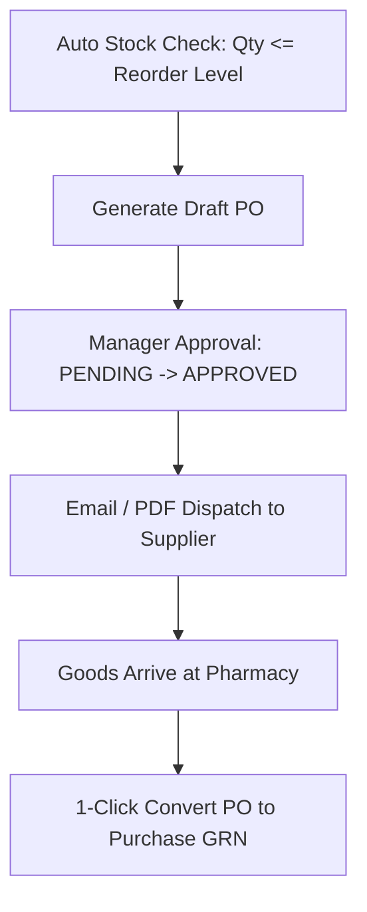

# 📋 Module Documentation: Purchase Orders (PO) (`/purchase-orders`)

---

## 🎯 1. Overview & Business Purpose
The **Purchase Orders (PO)** module automates store procurement. It calculates low-stock items based on defined **Reorder Levels**, compiles supplier-wise Purchase Orders, tracks approval stages, and allows 1-click conversion into Goods Received Note (GRN) Purchases upon delivery.

---

## 🔄 2. Complete PO Life-Cycle

---

## 📑 3. PO Statuses & Transitions

* **`DRAFT`**: Order being prepared by store staff.
* **`PENDING_APPROVAL`**: Submitted for manager/owner review.
* **`APPROVED`**: Ready to be sent to distributor.
* **`PARTIALLY_RECEIVED`**: Some items delivered, remaining pending.
* **`COMPLETED`**: All items received and converted to inventory batches.
* **`CANCELLED`**: Order aborted.

---

## 📡 4. Backend Endpoints & Database Tables

* `GET /api/purchase-orders`: List purchase orders with status filters.
* `POST /api/purchase-orders`: Create new PO with estimated rates.
* `POST /api/purchase-orders/:id/convert`: Converts PO items to actual `Purchase` GRN inward.
* **Prisma Models**: `PurchaseOrder`, `PurchaseOrderItem`, `Supplier`.
