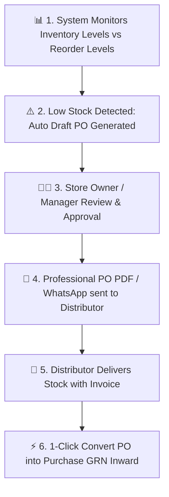

# 📋 Complete Buyer's Guide & Manual: Purchase Orders (PO) & Procurement Engine (`/purchase-orders`)

> **Target Audience:** Medical Store Owners, Procurement Officers, Supply Chain Managers, and Software Buyers.

---

## 🌟 1. Executive Summary: Never Run Out of Stock Again!

Pharmacy me ek golden rule hota hai: **"Jo dawa dukan par nahi hai, wo sale hamesha ke liye kho gayi."**

Jab koi customer doctor ka prescription lekar aata hai jisme 5 dawaiyan likhi hain:
- Agar aapke paas 4 dawaiyan hain aur 1 antibiotic khatam (Out of Stock) hai, to customer wo 4 dawaiyan bhi aapke paas chhod kar dusri dukan par chala jata hai jahan saari dawaiyan ek sath milti hain.
- Roz subah store owner physical shelves ko dekh kar register me hath se likhta hai: *"Azithromycin 10 box mangwana hai, Pan-D 20 box mangwana hai..."* Is manual kaam me ghanto barbad hote hain aur important items chhut jate hain.

**MedCare Purchase Orders (PO) Module** aapki pharmacy ki procurement ko **100% automated** bana deta hai. Yeh dukan ki har ek medicine ki sales speed aur **Reorder Safety Level** ko 24x7 monitor karta hai. Jaise hi stock limit se niche jata hai, system automatically supplier-wise Purchase Orders prepare kar deta hai!

---

## 🔄 2. Complete Purchase Order Lifecycle

---

## ⚙️ 3. How the Auto-Reorder Procurement Algorithm Works

Har medicine me aap do limits define karte hain:
1. **`reorderLevel` (Warning Threshold):** Minimum stock limit jiske niche aate hi order lagana chahiye (e.g. 20 Strips).
2. **`reorderQty` (Standard Order Batch):** Ek baar me kitna quantity order karna hai (e.g. 50 Strips).

### Live Working Example:
- Aapke paas `Dolo 650` ka reorder level `20 Strips` hai.
- Aaj din bhar me 80 strips bik gayi aur stock **15 Strips** bacha.
- System automatic trigger karta hai:
  $$\text{Current Stock (15)} < \text{Reorder Level (20)} \implies \mathbf{Auto\ PO\ Required!}$$
- System Dolo 650 ke default distributor (jaise `Micro Labs Stockist`) ka naam uthata hai aur **50 Strips** ka Purchase Order draft bana kar owner ki screen par rakh deta hai!

---

## 📑 4. Purchase Order Statuses & Approval Stages

Har PO ek transparent lifecycle se guzarta hai:

| PO Status | Meaning & Next Action |
|---|---|
| **🟡 `DRAFT`** | PO tayar kiya gaya hai, abhi manager ka review baki hai. Rates aur quantities edit ki ja sakti hain. |
| **🔵 `PENDING_APPROVAL`** | Senior Pharmacist ne review karke Store Owner ke paas authorization ke liye bheja hai. |
| **🟢 `APPROVED`** | Owner ne approve kar diya. Ab yeh official legal PO ban chuka hai aur PDF/WhatsApp ke zariye distributor ko bhejne ke liye ready hai. |
| **🟠 `PARTIALLY_RECEIVED`** | Distributor ne 50 strips me se 30 strips bhej di hain, 20 strips baki hain. |
| **🟣 `COMPLETED`** | Saara maal dukan par aa gaya aur PO 100% receive ho chuka hai. |
| **🔴 `CANCELLED`** | Order cancel kar diya gaya. |

---

## ⚡ 5. The Magic Button: 1-Click Convert PO to Purchase GRN

Distributor jab dukan par delivery lekar aata hai:
- **Traditional Software:** Staff dobara se pura bill hath se type karta hai (Medicine, Qty, Rate, GST) — 20 minute lagte hain.
- **MedCare PO System:** Staff sirf PO number search karta hai aur **"Convert to Purchase"** button dabata hai:
  1. Saari medicines, quantities, aur estimated rates automatic Purchase Inward screen par load ho jate hain.
  2. Staff ko sirf distributor ka chhape hua Invoice No aur Batch/Expiry enter karke Save dabana hota hai (Pura kaam 30 second me khatam!).

---

## 🛡️ 6. Common Procurement Disasters Jo Yeh Module Rokta Hai

1. **Dead Stock Ka Over-Purchase (Paisa Phasna):**
   * *Problem:* Aesi dawa jiska sale nahi hai, staff ne galti se uske 50 boxes order kar diye aur lakho rupaye block ho gaye.
   * *Protection:* PO banate waqt system medicine ki pichle 30 din ki sales velocity dikhata hai taki sirf bikne wala maal hi order ho.
2. **Order Duplicate Lag Jana:**
   * *Problem:* Morning shift wale ne bhi order de diya aur evening shift wale ne bhi same distributor ko order bhej diya.
   * *Protection:* Agar kisi item ka active PO already open hai, to system dusra PO generate karne se pehle duplicate alert show karta hai.

---

## ❓ 7. Buyer FAQs

**Q1: Kya hum PO ka PDF distributor ko WhatsApp ya Email kar sakte hain?**
* **Ans:** Haan! 1-click me professional Purchase Order PDF download hota hai jisme aapki pharmacy ka Drug License, GSTIN, required item quantities aur expected purchase rates print hote hain.

**Q2: Kya hum emergency me bina PO ke direct Purchase bill chadh sakte hain?**
* **Ans:** Haan, direct purchase inward hamesha available rehta hai. PO option procurement ko automate aur organize karne ke liye hai.
