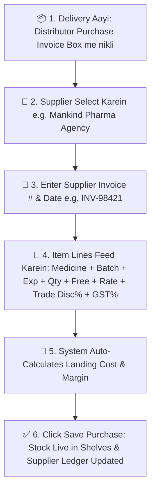

# 🚚 Complete Buyer's Guide & Manual: Purchases & Goods Received Note (GRN) (`/purchases`)

> **Target Audience:** Medical Store Owners, Purchase Managers, Inventory Heads, Accountants, and Software Buyers.

---

## 🌟 1. Executive Summary: The Engine of Pharmacy Stock & Margins

Medical store chalane ka sabse important hissa hota hai: **"Distributor se sahi daam par dawa khareedna aur usko sahi tarike se system me chadhana (Stock Inward / GRN)."**

Rozana dukan par alag-alag wholesale stockists (jaise Mankind, Sun Pharma, Cipla, Abbott) ke delivery boys aate hain aur bade-bade purchase bills (chalan) dekar jate hain. 

Agar purchase entry me thodi si bhi galti ho jaye:
- *Distributor ka diya hua 10+1 Free scheme ya 5% trade discount system me feed nahi hua, to aapko pata hi nahi chalega ki dawa kitne ki padi.*
- *Agar batch number ya expiry galat chadh gayi, to billing ke time galti hogi.*
- *Agar GST Input Tax Credit (ITC) theek se track nahi hua, to tax return me lakho rupaye ka nuksan hoga.*
- *Distributor ke khate (Ledger) me bill amount galat chadh gaya, to payment ke time jhagda hoga.*

**MedCare Purchases & GRN Module** is pure process ko frictionless, automated aur 100% accurate bana deta hai. Bill enter karte hi naye batches automatic ban jate hain, free scheme schemes adjust ho jati hain, aur GST ITC claim record me lock ho jata hai.

---

## 📝 2. Step-by-Step Purchase Inward Workflow

---

## 📊 3. Detailed Data Fields in Purchase Entry

| Field Name | Real Meaning & Practical Value | Example |
|---|---|---|
| **Supplier** | Distributor ka naam (Dropdown search) | `Mankind Pharma Stockist` |
| **Invoice Number** | Distributor ke bill par chhape bill number | `MP-2026-8941` |
| **Invoice Date** | Bill banne ki tareekh | `26/08/2026` |
| **Payment Due Date** | Distributor ko payment dene ki aakhiri tareekh (Credit period) | `26/09/2026 (30 Days Credit)` |
| **Medicine Name** | Dawa ka naam | `Augmentin 625 Duo Tablet` |
| **Batch Number** | Box/Strip par likha batch number | `AUG-2026-B8` |
| **Expiry Date** | Dawa ki expiry date | `08/2028` |
| **Billed Quantity** | Kitne boxes/strips kharide gaye | `50 Strips` |
| **Free / Scheme Qty** | Company dwara di gayi free scheme dawa | `5 Strips Free (10+1 Scheme)` |
| **Purchase Rate** | Distributor ka base rate (per strip) | `₹160.00` |
| **MRP** | Strip par likha Maximum Retail Price | `₹223.50` |
| **Trade Discount %** | Distributor dwara diya gaya percentage discount | `5.0%` |
| **GST %** | Medicine ka GST rate slab | `12% (6% CGST + 6% SGST)` |

---

## 🧮 4. Mathematical Formulas: True Landing Cost & Profit Margin

Retail business me munafa tab banta hai jab aapko pata ho ki **"1 Tablet actual me dukan tak aate-aate kitne ki padi."**

### A. Free Scheme & Trade Discount Adjustment (Effective Landing Cost):
Agar aapne ₹160 ke rate par 50 strips kharidi, 5% trade discount mila, aur sath me 5 strips FREE mili:

$$\text{Gross Purchase Amount} = 50 \times 160 = ₹8,000.00$$
$$\text{Trade Discount (5\%)} = ₹8,000 \times 0.05 = -₹400.00$$
$$\text{Net Taxable Cost} = ₹8,000 - ₹400 = ₹7,600.00$$
$$\text{GST (12\%)} = ₹7,600 \times 0.12 = +₹912.00$$
$$\text{Total Amount Payable to Distributor} = ₹7,600 + ₹912 = \mathbf{₹8,512.00}$$

$$\mathbf{Total\ Physical\ Strips\ Received} = 50 + 5\text{ (Free)} = \mathbf{55\ Strips}$$

$$\mathbf{True\ Effective\ Landing\ Cost\ Per\ Strip} = \frac{₹7,600}{55} = \mathbf{₹138.18\ per\ strip}$$

*Software automatically calculated landing cost ₹138.18 nikal deta hai! Agar aap ise ₹200 me bechte hain, to aapko exact ₹61.82 per strip ka munafa hoga!*

---

## 🏛️ 5. Central Purchase Allocation (Multi-Branch Chains)

Agar aapke paas 3 branches hain aur aapne Main Warehouse me 1,000 strips ka bulk purchase kiya:
* MedCare **Central Purchase Allocation Engine** ke zariye aap 1 single purchase bill ko teeno branches me divide kar sakte hain:
  - `MAIN-01` $\rightarrow$ 500 Strips
  - `BRANCH-02` $\rightarrow$ 300 Strips
  - `BRANCH-03` $\rightarrow$ 200 Strips
* System teeno branches ki inventory me unke respective quantities automatic credit kar deta hai!

---

## 🛡️ 6. Common Purchase Inward Mistakes Jo Yeh Module Rokta Hai

1. **Short Expiry Dawa Accept Kar Lena:**
   * *Problem:* Distributor purana stock chipka jata hai jiski expiry 3 mahine baad hai.
   * *Protection:* Agar feed ki gayi expiry date agle 90 dino ke andar aati hai, to system screen par **Yellow Near-Expiry Warning** pop-up deta hai taaki aap delivery reject kar sakein.
2. **Distributor Ka Rate Badha Kar Lagana:**
   * *Problem:* Pichle mahine rate ₹150 tha, is mahine distributor ne bina bataye ₹165 laga diya.
   * *Protection:* System pichle purchase rate ko compare karke rate difference highlight kar deta hai.

---

## ❓ 7. Buyer FAQs

**Q1: Kya purchase save karne ke baad inventory me manual add karna padta hai?**
* **Ans:** Bilkul nahi! Purchase save hote hi 1 micro-second ke andar naye batches live inventory aur POS search me aa jate hain.

**Q2: Kya hum supplier ko dene wali payment ka hisab yahan dekh sakte hain?**
* **Ans:** Haan! Har purchase bill automatically Supplier Ledger me credit entry generate karta hai jisse pata rehta hai ki kis distributor ko kitna payment kab dena hai.
