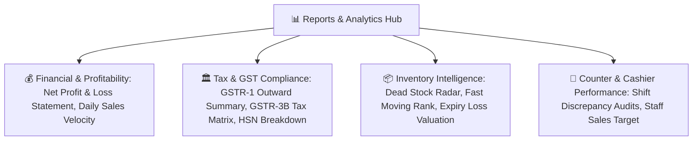

# 📈 Complete Buyer's Guide & Manual: Reports, GST Filing & Business Intelligence (`/reports`)

> **Target Audience:** Pharmacy Owners, Chartered Accountants (CA), Tax Auditors, Managing Directors, and Software Buyers.

---

## 🌟 1. Executive Summary: Turn Raw Data into Actionable Profit

Medical store chalane me sirf dawa bechna kafi nahi hai. Business ko grow karne aur tax penalties se bachne ke liye aapko 3 baatein pata honi chahiye:
1. **Financial Health:** *Mera real Gross aur Net Profit kitna bana?*
2. **Tax Compliance (GST Ready):** *Har mahine GSTR-1 aur GSTR-3B return bharte waqt mere CA ko kitna tax dikhana hai?*
3. **Inventory Efficiency:** *Meri dukan ka kon sa 20% maal 80% bikri de raha hai, aur kon sa Dead Stock dukan ki shelves par lakho rupaye block karke baitha hai?*

**MedCare Reports & Analytics Suite** aapke pure business ka X-Ray report 1 click me generate karta hai. Isme complex accounting formulas ko simple visual graphs aur ready-to-file GST tax tables me present kiya gaya hai.

---

## 📊 2. Comprehensive Report Portfolio

---

## 📑 3. Deep-Dive into Core Report Types

### 1. 💵 Real-Time Profit & Loss (P&L) Statement
Aam retail software sirf Sales Total dikhate hain. MedCare POS batch-wise cost calculation par chalta hai:

$$\mathbf{Gross\ Sales\ Revenue} = \text{Total Billed Amount (Excl. Tax)}$$
$$\mathbf{Cost\ of\ Goods\ Sold\ (COGS)} = \sum (\text{Sold Qty} \times \text{Batch Purchase Cost})$$
$$\mathbf{Gross\ Profit} = \text{Gross Sales Revenue} - \text{COGS}$$
$$\mathbf{Operating\ Expenses} = \text{Shop Rent} + \text{Salaries} + \text{Electricity} + \text{Petty Expenses}$$
$$\mathbf{Net\ Business\ Profit} = \mathbf{Gross\ Profit} - \mathbf{Operating\ Expenses} - \mathbf{Sales\ Discounts}$$

---

### 2. 🏛️ GST Compliance & Filing (GSTR-1 & GSTR-3B)
Har mahine 10 se 20 tareekh ke beech GST return bharna mandatory hota hai:
* **GSTR-1 B2C Small:** Retail walk-in cash/UPI sales ka state-wise aur tax-rate-wise (0%, 5%, 12%, 18%) consolidated turnover.
* **GSTR-1 B2B Invoices:** Nursing homes aur doctors ko bechi gayi tax invoices jinpar unka 15-digit GSTIN print hota hai.
* **HSN Code 3004 Summary:** Pharmaceuticals ka HSN code, total units sold, taxable value, aur Central (CGST) / State (SGST) tax split.
* **1-Click CA Export:** Pura data formatted Excel sheet me export hota hai jise aapka CA direct GST portal par JSON me upload kar sakta hai.

---

### 3. 🛑 Dead Stock & Slow Moving Inventory Radar
Dukan me lakho rupaye ka stock aesa hota hai jo pichle 6 mahine se bik nahi raha:
* Yeh report aesi medicines ki list dikhata hai jinka **0 Sales Velocity** hai pichle 90 ya 180 dino me.
* **Actionable Insight:** In items ko discount par nikalein ya distributor ko return karke cash free karein!

---

## ❓ 4. Buyer FAQs

**Q1: Kya hum specific dates (e.g. 1st April to 31st March) ka annual report nikal sakte hain?**
* **Ans:** Haan! Custom date range picker se aap kisi bhi din, hafte, mahine ya poore financial year ka report 1 second me nikal sakte hain.

**Q2: Kya branch-wise aur combined company report dono milti hai?**
* **Ans:** Haan! Individual branch ka P&L alag dekh sakte hain aur Super Admin multi-branch combined organization balance sheet bhi generate kar sakta hai.
