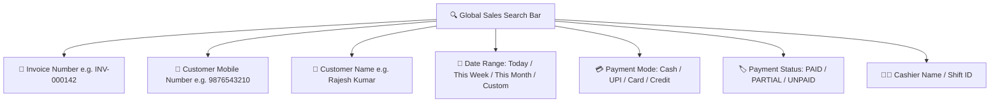

# 🧾 Complete Buyer's Guide & Manual: Sales & Invoices Master Ledger (`/sales`)

> **Target Audience:** Medical Store Owners, Pharmacists, Accountants, Tax Consultants, and Software Buyers.

---

## 🌟 1. Executive Summary: Why Every Pharmacy Needs an Unbreakable Sales Ledger

Aapki medical shop par mahine me hazaaron bills bante hain. Kabhi kisi customer ko purane bill ka print chahiye hota hai, kabhi kisi company ya TPA insurance claim ke liye itemized tax invoice chahiye hoti hai, to kabhi CA / accountant ko mahine ka GST sales summary audit karna hota hai.

Purane software me ya physical registers me:
- *3 mahine purana bill dhundhne me 1 ghanta lag jata hai.*
- *Customer bolta hai "Maine pichle hafte dawa li thi uska naam kya tha?" aur staff register ke panne palatta reh jata hai.*
- *Credit (Udhar) par gayi sales ka record alag dairy me kho jata hai.*

**MedCare Sales & Invoices Module** aapki dukan ka **Master Digital Sales Vault** hai. Isme aapki dukan ka pehla bill ho ya 1 lakh-wa bill — har ek transaction batch number, expiry, customer phone, tax breakdown, aur cashier signature ke sath **0.1 second me search** hokar screen par aa jata hai.

---

## 🔍 2. Powerful Search & Multi-Filter Engine

Is page par aate hi aapko ek smart Google-style search bar milta hai jisme aap kisi bhi criterion se bill dhoondh sakte hain:

---

## 📊 3. Understanding the Master Sales Table

Table me har ek row ek complete sale ko represent karti hai. Niche har ek column ka detail explanation diya gaya hai:

| Column Name | Real Meaning & Business Use |
|---|---|
| **Invoice #** | Sequential unique bill number (e.g. `MAIN-000105`). Kabhi duplicate nahi hota. |
| **Date & Time** | Bill banne ka exact timestamp (e.g. `26 Aug 2026, 11:30 AM`). |
| **Customer Info** | Patient/Customer ka naam aur 10-digit mobile number. |
| **Items Count** | Kitni alag-alag dawaiyan is bill me bechi gayi hain (e.g. `3 Items`). |
| **Subtotal** | Base rate $\times$ Quantity ka total (Discount aur Tax se pehle). |
| **Discount** | Cashier ya system dwara diya gaya discount (Green color me, e.g. `-₹25.00`). |
| **Tax / GST** | Central GST (CGST) aur State GST (SGST) ka kul amount. |
| **Round-Off** | Paise rounding adjustment (e.g. `-₹0.67`). |
| **Net Total** | Customer se liya jane wala final amount (e.g. `₹450.00`). |
| **Paid Amount** | Customer ne actual me kitna paisa diya. |
| **Status** | `PAID` (Pura paisa mila), `PARTIAL` (Kuch baki hai), ya `CREDIT` (Pura udhar). |
| **Cashier** | Kis staff member ne yeh bill banaya (Audit tracking ke liye). |

---

## ⚡ 4. 1-Click Action Hub (Har Bill Par Kya-Kya Kar Sakte Hain?)

Har bill ke right side me diye gaye 3-dots actions menu par click karke aap ye kaam kar sakte hain:

### A. 📄 View Itemized Breakdown (Line-Item Details)
* Click karte hi bill ka complete X-Ray khul jata hai:
  - Har dawa ka Brand Name, Generic Name, HSN Code (3004).
  - Exact **Batch Number** aur **Expiry Date** jo customer ko di gayi.
  - Tax slab (0%, 5%, 12%, 18%) aur CGST/SGST split.
* **Insurance Claim Benefit:** TPA aur Mediclaim insurance reimbursement ke liye exact batch details mandatory hoti hain.

### B. 🖨️ Instant Reprint Receipt (Watermarked)
* Agar customer bolta hai *"Mera bill kho gaya, dobara print kar do"*:
* 1-click me thermal 58mm/80mm ya A4 format me reprint nikalta hai.
* System automatically bill ke top par **`[DUPLICATE REPRINT]`** ka watermark laga deta hai taki koi is bill ka misuse karke company ya insurance me do baar claim na le sake.

### C. 📥 Download Institutional PDF Tax Invoice
* 1-click me beautiful, colored GST Tax Invoice PDF format me download hoti hai jisme Store Logo, Drug License 20B/21B, GSTIN, Bank QR Code, aur Terms of Sale print hote hain.

### D. 🔄 Convert to Return (Wapasi)
* Agar customer dawa wapas karne aaya hai, to is button par click karte hi yeh seedhe **Sales Return Module** me us bill ke saare items load kar deta hai.

### E. 🚫 Cancel / Delete Bill (Owner / Admin Only)
* Agar cashier ne galti se galat bill bana diya:
* Sirf Super Admin ya Store Owner ke paas bill cancel karne ka permission hota hai.
* Bill cancel hote hi:
  1. Bechi gayi saari dawaiyan automatic unke respective batches me wapas add ho jati hain.
  2. Sales ledger aur cash drawer se bill amount deduct ho jata hai.
  3. Audit log me cancel karne wale ka naam aur reason permanently save ho jata hai.

---

## 🧮 5. Tax & Accounting Compliance (GST Ready)

MedCare Sales Ledger Bharat sarkar ke GST Niyam aur Drug & Cosmetics Act ke anurup 100% compliant hai:
- **B2C Sales:** Local retail walk-in customers ka daily turnover calculation.
- **B2B Invoices:** Agar kisi hospital ya nursing home ko supply kiya hai, to unka 15-digit GSTIN record me save hota hai jisse wo GSTR-2B me Input Tax Credit (ITC) claim kar sakein.

---

## ❓ 6. Buyer FAQs

**Q1: Kya 2 saal purana bill bhi search ho jayega?**
* **Ans:** Haan! Cloud PostgreSQL database me aapke saare bills lifetime safely store rehte hain aur 2 saal purana bill bhi 1 second ke andar search ho jata hai.

**Q2: Agar kisi staff ne bill delete karne ki koshish ki to kya owner ko pata chalega?**
* **Ans:** Cashier ko bill delete karne ka option hi nahi dikhta. Aur agar Admin delete karta hai, to permanent Audit Trail me record lock ho jata hai.

**Q3: Kya hum monthly sales report ko Excel me export kar sakte hain?**
* **Ans:** Haan, 1-click me pura monthly sales ledger Excel / CSV file me export ho jata hai jise aap seedhe apne CA ko GST return bharne ke liye bhej sakte hain.
