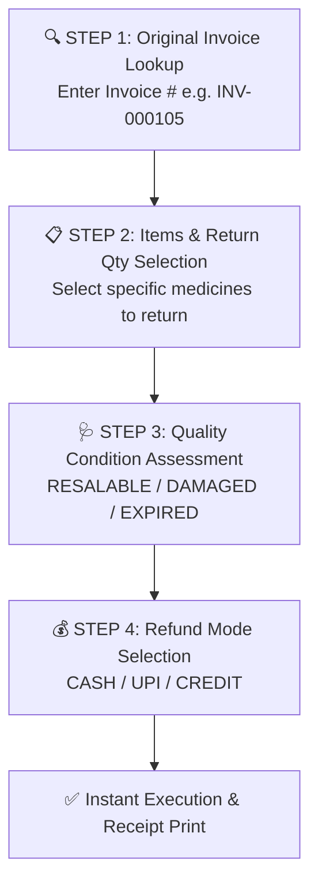

# 🔄 Complete Buyer's Guide & Manual: Sales Returns & Refund Management (`/sales-returns`)

> **Target Audience:** Pharmacy Owners, Cashiers, Inventory Managers, Pharmacists, and Software Buyers.

---

## 🌟 1. Executive Summary: The Customer Return Dilemma

Medical store par customer ka dawa wapas karne aana ek roz ka mamla hai:
- Doctor ne dawa change kar di.
- Patient theek ho gaya aur bachi hui 5 tablets wapas karne aaya.
- Ya customer ne galti se galat syrup le liya.

Lekin ek pharmacy owner ke liye sales return handle karna 3 bade challenges khade karta hai:
1. **Financial Challenge:** Agar customer ko cash wapas diya gaya, to sham ko cashier ke galle (drawer) me cash kam ho jata hai. Agar software isko track na kare to cashier fraud kar sakta hai.
2. **Inventory Quality Challenge:** Jo dawa wapas aayi hai, kya wo sellable (acchi condition) me hai? Agar wo strip kharab/cut hai ya seal tooti hai, to usko dobara sellable stock me add nahi kiya ja sakta, warna dusre patient ki jaan ko khatra ho sakta hai.
3. **Discount Adjustment Challenge:** Agar bechte waqt customer ko 10% discount diya gaya tha, to wapas karte waqt pura MRP refund nahi hona chahiye, balki discounted rate hi refund hona chahiye!

**MedCare Sales Returns & Refund Engine** in teeno challenges ko 100% automate kar deta hai. Yeh module return aayi hui dawa ki quality inspect karta hai, accurate discounted refund calculate karta hai, aur cash drawer ko automatically adjust karta hai.

---

## 🔄 2. The 4-Step Sales Return Workflow

---

## ⚙️ 3. Step-by-Step Feature Walkthrough

### Step 1: Original Invoice Lookup (Bill Verification)
* Cashier customer se original bill number poochta hai (ya customer ke mobile number se search karta hai).
* **Benefit:** Fake returns rokta hai. Koi customer dusri dukan se kharidi hui dawa aapki dukan par wapas karke cash nahi le ja sakta!

### Step 2: Line-Item & Quantity Picker
* System screen par us bill me bechi gayi saari dawaiyan unke batch number aur sold rate ke sath dikhata hai.
* Cashier select karta hai ki customer kon si dawa aur kitni quantity wapas kar raha hai.
* **Safety Guard:** Agar bill me 10 tablets bechi gayi thi, to cashier 11 tablets return nahi kar sakta (Max limit = Sold Qty).

---

### Step 3: Restock Condition Categorization (Crucial Safety Feature)

Cashier ko har returned item ke liye 3 me se 1 condition choose karni hoti hai:

| Return Condition | Dawa Ki Halat | Software Action (Inventory Me Kya Hoga?) |
|---|---|---|
| **🟢 `RESALABLE`** | Sealed, bilkul acchi condition, expiry door hai. | Dawa **automatically active sellable stock (`Batch.currentQty`) me wapas jud jati hai** taki agla customer ise kharid sake. |
| **🟡 `DAMAGED`** | Strip mud gayi hai, seal khul gayi hai, bottle leak hai. | Dawa sellable stock me nahi jati! Yeh **`Batch.damagedQty` (Quarantine stock) me lock ho jati hai** taki galti se koi ise dobara na bech sake. |
| **🔴 `EXPIRED`** | Expiry date nikal chuki hai. | Dawa **`Batch.expiredQty`** me lock ho jati hai taki supplier se expiry replacement ya credit note manga ja sake. |

---

### Step 4: Refund Mode Execution (Paisa Kaise Wapas Kiya Gaya?)

1. **💵 CASH Refund (Galle Se Cash Diya):**
   - Agar cashier ne drawer se nikal kar ₹150 cash customer ko diye, to system active cashier shift ke expected drawer cash me se ₹150 automatic minus kar leta hai.
   - Sham ko shift band karte waqt hisab me 0 discrepancy aayegi.
2. **📱 UPI / Bank Refund:**
   - Agar online payment wapas ki gayi, to drawer cash affect nahi hoga.
3. **💳 Customer Credit (Khata Adjustment):**
   - Agar regular udhar customer ne dawa wapas ki hai, to uske khata ledger me se utna balance kam ho jata hai.

---

## 🧮 4. Mathematical Refund Formula

Maan lijiye customer ne ₹100 ki dawa 10% discount par ₹90 me kharidi thi:

$$\text{Effective Unit Rate} = \text{Sold Rate} - \text{Discount} = ₹100 - ₹10 = ₹90.00$$

$$\mathbf{Total\ Refund\ Amount} = \text{Effective Unit Rate} \times \text{Returned Qty}$$

*Agar customer 1 strip wapas karta hai, to system usko exact ₹90.00 refund karega, ₹100 nahi! Isse dukan ka ₹10 ka loss hone se bach jata hai.*

---

## 🛡️ 5. Common Pharmacy Mistakes Jo Yeh Module Rokta Hai

1. **Dusri Dukan Ki Dawa Ka Refund Dena:**
   * *Traditional Software:* Bina bill ke log dusri dukan ki expired dawa lakar cash mangte hain.
   * *MedCare:* Original invoice aur batch number match hone par hi return allow hota hai.
2. **Kharab Dawa Dobara Dusre Patient Ko Bik Jana:**
   * *Traditional Software:* Returned dawa automatic stock me jud jati hai aur agla patient kharab dawa le jata hai.
   * *MedCare:* `DAMAGED` mark karne par dawa POS search se gayab ho jati hai.
3. **Cashier Ka Fake Return Bana Kar Cash Chori Karna:**
   * *Traditional Software:* Cashier jhoota return dikha kar galle se cash nikal leta hai.
   * *MedCare:* Return voucher par original bill number, cashier ID, aur customer phone permanently logged rehta hai.

---

## ❓ 6. Buyer FAQs

**Q1: Kya customer sirf 2 goli wapas kar sakta hai agar usne 10 goli kharidi thi?**
* **Ans:** Haan! Partial return fully supported hai. 10 me se 2 wapas karne par sirf 2 goli ka refund banega aur baki 8 goli bill me sold status me rahengi.

**Q2: Kya return receipt print hoti hai?**
* **Ans:** Haan, return voucher ki receipt thermal printer se instant print hoti hai jisme Customer Signature aur Cashier Signature ke columns hote hain.
