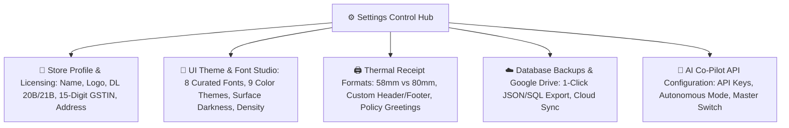

# 🎨 Complete Buyer's Guide & Manual: Settings, Drug Licensing & UI Theme Studio (`/settings`)

> **Target Audience:** Pharmacy Owners, Branding Heads, System Administrators, and Software Buyers.

---

## 🌟 1. Executive Summary: Total Control Over Store Identity & Experience

Har pharmacy ka apna brand aur unique setup hota hai:
- *Kisi store ko 2-inch thermal slip printer chahiye, kisi ko A4 hospital format.*
- *Dukan ka Drug License (Form 20B/21B) aur GSTIN receipt par print hona kanoonan jaruri hai.*
- *Staff ko computer screen par din bhar kaam karne ke liye eye-friendly dark theme aur clear Hindi/English typography pasand hoti hai.*
- *Data ka daily automated backup Google Drive me cloud safe hona chahiye.*

**MedCare Settings & UI Theme Studio** aapko complete configuration freedom deta hai. Bina kisi developer ya coding ki madad ke, aap apni pharmacy ka logo, fonts, theme colors, printer widths, tax rates, aur cloud backup settings khud configure kar sakte hain.

---

## 🛠️ 2. Comprehensive Settings Tabs & Capabilities

---

## 🎨 3. The UI Theme, Typography & Appearance Studio

Yeh module Bharat ka sabse advanced UI personalization system hai jo computer ki screen par aankhon par zero strain deta hai:

### A. 8 Curated Medical & Enterprise Typography Fonts:
1. **`Inter`** *(Modern Clean Minimalist - Default)*
2. **`Plus Jakarta Sans`** *(High-legibility geometric UI font)*
3. **`Poppins`** *(Friendly rounded modern look)*
4. **`Outfit`** *(High-tech futuristic clean look)*
5. **`Space Grotesk`** *(Sharp tech aesthetic)*
6. **`Roboto`** *(Google standard clean font)*
7. **`Merriweather`** *(Editorial serif elegance)*
8. **`JetBrains Mono`** *(Financial code high-precision font)*
* **Custom Google Font Input:** Aap koi bhi custom web font URL paste karke apply kar sakte hain!

---

### B. 9 Curated Color Palettes + Custom Color Picker:
* 🟢 **Emerald (Health & Wellness)** | 🔵 **Sky (Clinical Clean)** | 🟣 **Indigo (Deep Professional)**
* 🟪 **Violet (Modern Purple)** | 🔴 **Rose (High Contrast)** | 🟡 **Amber (Warm Golden)**
* 🔷 **Cyan (Medical Precision)** | 🌲 **Forest (Natural Organic)** | ⚪ **Slate (Minimal Grey)**
* **Custom Hex Color Picker:** Aap apni dukan ke exact logo ka hex code (e.g. `#10B981`) choose kar sakte hain.

---

### C. UI Density & Corner Radius Styles:
* **Density:** `Compact` (13px text - small screens), `Default` (14px), `Comfortable` (15px), `Large` (16px - touch monitors).
* **Corner Radius:** `Sharp (4px)`, `Modern (8px)`, `Smooth (14px)`, `Round (20px)`.
* **Dark Atmosphere Surfaces:** Midnight Blue, Obsidian, Charcoal, Deep Navy.
* **Interactive Live Sandbox:** Settings page par live preview box hota hai jisme buttons aur badges par real-time preview dekh kar aap **"Save Theme"** kar sakte hain.

---

## 🖨️ 4. Thermal Printer & Invoice Customization

1. **Paper Size Selection:** `58mm (2-Inch)` ya `80mm (3-Inch)`.
2. **Header Message:** e.g. `*** MEDICINES ONCE SOLD WILL BE REPLACED WITHIN 7 DAYS ***`
3. **Footer Message:** e.g. `Get Well Soon! 🙏 Thank you for visiting MedCare Pharmacy.`
4. **Bank UPI QR Code:** Customer ko receipt par UPI scan karke turant pay karne ka option.

---

## ☁️ 5. Automated Database Backups & Google Drive

* **1-Click Manual Backup:** Ek click me puri database ka compressed encrypted `.json` / `.sql` snapshot download hota hai.
* **Automated Cloud Backup:** Daily midnight ko aapke official Google Drive account me auto-sync hota hai taaki computer kharab ya chori hone par bhi aapka 100% data cloud me surakshit rahe!

---

## ❓ 6. Buyer FAQs

**Q1: Agar maine font ya color badal diya to kya baki computers par bhi badal jayega?**
* **Ans:** Settings me aap choose kar sakte hain: "Apply to Entire Store (Global)" ya "Apply to My Device Only (Local)".

**Q2: Kya hum print receipt par apna personal Drug License number chhap sakte hain?**
* **Ans:** Haan! Store settings me Form 20B aur 21B fill karne par yeh automatically har ek thermal receipt aur A4 tax invoice ke header me print hota hai.
