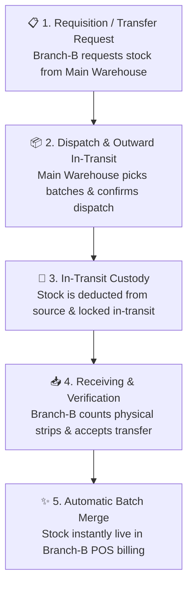

# 🔄 Complete Buyer's Guide & Manual: Inter-Branch Stock Transfers (`/stock-transfers`)

> **Target Audience:** Multi-Store Pharmacy Chains, Hospital Dispensary Networks, Franchise Owners, and Software Buyers.

---

## 🌟 1. Executive Summary: Unifying Your Multi-Store Inventory

Agar aap ek se jyada medical stores (e.g. Main Road Branch, Hospital OPD Branch, City Market Branch) chalate hain, to sabse badi samasya hoti hai: **"Ek branch me dawa ka dher laga hai aur dusri branch me wahi dawa out of stock hai."**

Real-World Scenarios:
- `Branch-A` ke paas Pantoprazole 40mg ke 200 strips pache hain jo agle 4 mahine me expire ho jayenge kyunki wahan sale slow hai.
- `Branch-B` hospital ke saamne hai jahan roz 50 strips ki demand hai aur wahan stock khatam ho chuka hai.
- Agar dono branches aapas me stock transfer karti hain bina digital record ke:
  - *Branch-A ka hisab bigad jata hai ki mera stock kahan gaya.*
  - *Branch-B me stock system me show nahi karta to cashier bill nahi bana pata.*
  - *Raste me agar koi strip kho jaye ya chori ho jaye to dono branches ek dusre par ilzam lagati hain.*

**MedCare Inter-Branch Stock Transfer Engine** multi-store pharmacy chains ke liye banaya gaya hai. Yeh source branch se stock deduct karne se lekar, raste me transit track karne, aur destination branch par batch-to-batch seamless merge karne tak ka **100% digital audit trail** maintain karta hai.

---

## 🚚 2. The 3-Stage Inter-Branch Transfer Lifecycle

---

## ⚙️ 3. Step-by-Step Feature Walkthrough

### Stage 1: Transfer Initiation (Dispatch from Source Branch)
1. **Source & Destination Branch Selection:**
   - Source: `MAIN-01 · Main Dispensary`
   - Destination: `BRANCH-02 · City Hospital Branch`
2. **Batch-Specific Stock Picking:**
   - Pharmacist dawa ka naam select karta hai (e.g. `Pan-D Capsule`).
   - Source branch me available batches ki list khulti hai.
   - Pharmacist specific batch select karta hai (e.g. `Batch PD-99, Exp: 12/2027, Available: 150 Strips`).
   - Transfer Quantity: `50 Strips` enter karta hai.
3. **Dispatch Confirmation:**
   - Jaise hi Dispatch par click hota hai:
     - Source branch ke `currentQty` me se **50 Strips turant minus** ho jate hain.
     - System Transfer Delivery Challan print karta hai jo delivery boy ke sath jata hai.

---

### Stage 2: In-Transit Security & Tracking
* Jab stock raste me hota hai, to status **`IN_TRANSIT`** rehta hai.
* Is dauran:
  - Source branch is stock ko dobara bech nahi sakti (Deducted).
  - Destination branch bina physical receiving ke ise bech nahi sakti.
* Isse inventory ghost-stock (hawa me stock) banne se bach jati hai.

---

### Stage 3: Receiving & Automated Batch Merging (Destination Branch)
Jab delivery parcel `Branch-02` par pahunchta hai:
1. Destination branch ka pharmacist **"Pending Transfers"** tab me challan open karta hai.
2. Box khol kar physical strips ginta hai.
3. **"Accept & Receive Stock"** button par click karta hai:
   - System automatically destination branch ke database me check karta hai:
     - *Kya Branch-02 me pehle se is dawa ka ye batch number exist karta hai?*
     - Agar **HAAN**, to purane batch me `+50 Strips` jud jate hain.
     - Agar **NAHI**, to Branch-02 ke liye naya Batch record create ho jata hai jisme same Expiry Date, MRP, aur Purchase Price preserve rehti hai!

---

## 🛡️ 4. Multi-Tenant Branch Isolation & Safety Safeguards

1. **Over-Transfer Prevention:**
   * Source branch apni available `currentQty` se 1 strip bhi jyada transfer nahi kar sakti.
2. **Discrepancy Reporting:**
   * Agar raste me 50 me se 2 strips damage ho gayi, to receiving pharmacist **Partial Receive** (48 Accepted, 2 Damaged) mark kar sakta hai. System 2 strips ko damage loss account me transfer kar deta hai.
3. **Audit Trail Logs:**
   * Transfer document par Dispatcher ka naam, Receiver ka naam, timestamp, aur Delivery Challan Number permanently lock rehta hai.

---

## ❓ 5. Buyer FAQs

**Q1: Kya stock transfer hone se GST tax invoice banti hai?**
* **Ans:** Same GSTIN ke andar inter-branch movement par **Delivery Challan** generate hota hai. Agar branches alag-alag states me hain, to system IGST Stock Transfer Invoice generate karta hai.

**Q2: Kya Main Branch se ek sath 50 medicines transfer ki ja sakti hain?**
* **Ans:** Haan! Single transfer challan me aap multiple medicines aur multiple batches add karke ek sath pura carton dispatch kar sakte hain.
