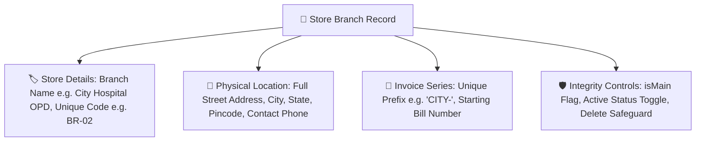

# 🌿 Complete Buyer's Guide & Manual: Multi-Branch & Store Chain Setup (`/super-admin/branches`)

> **Target Audience:** Pharmacy Chain Owners, Franchise Directors, Operations Heads, and Software Buyers.

---

## 🌟 1. Executive Summary: Scalability Without Chaos

Jab aap ek naya medical store ya hospital dispensary branch open karte hain, to sabse badi chunauti hoti hai: **"Nayi branch ka hisab purani branch se alag rakhna lekin central control apne haath me rakhna."**

- Nayi branch ka alag Drug License aur alag GSTIN ho sakta hai.
- Nayi branch ke bills ka sequence alag hona chahiye (e.g. `NORTH-0001` vs `MAIN-0001`) taaki GST return me invoice numbers collide na karein.
- Nayi branch ka stock alag hona chahiye taaki physical shelves ka audit exact match ho.
- Lekin Main Branch ka data kabhi galti se delete nahi hona chahiye!

**MedCare Multi-Branch Architecture** aapki pharmacy chain ko unlimited scalability deta hai. Aap 2 minute me nayi branch create kar sakte hain, custom invoice prefix set kar sakte hain, aur **Main Branch Deletion Protection** ke zariye apne core business data ko 100% surakshit rakh sakte hain.

---

## 🏬 2. Branch Attributes & Multi-Store Configuration

Nayi branch add karte waqt aap niche diye gaye fields configure karte hain:



---

## 🛡️ 3. The Unbreakable "Main Branch" Protection Architecture

Enterprise software me sabse dangerous disaster hota hai: *"Kisi junior admin ne galti se Main Headquarter Branch par delete click kar diya aur lakho bills aur stock records gayab ho gaye!"*

MedCare ERP me **Dual-Layer Main Branch Protection Guard** implement kiya gaya hai:

### 1. Frontend UI Guard:
* Jo branch `isMain: true` (jaise `MAIN-01 · Main Dispensary Branch`) hoti hai, uske aage **Delete Button permanently hide aur disabled** rehta hai.
* Uske aage ek shining **`👑 Primary HQ Branch`** badge dikhta hai.

### 2. Backend NestJS API Guard:
* Agar koi hacker ya malicious script direct API call (`DELETE /api/branches/:id`) bhejti hai, to backend controller check karta hai:
  ```typescript
  if (branch.isMain || branch.code === 'MAIN-01') {
    throw new ForbiddenException('CRITICAL ERROR: Main Primary Branch is permanently protected and cannot be deleted!');
  }
  ```
* Yeh aapke core business foundation ko 100% bulletproof security deta hai!

---

## 🧾 4. Independent Sequential Invoice Series (No Collision)

Har branch ki apni sequential invoice numbering hoti hai:
- **Main Branch Bills:** `MAIN-000101`, `MAIN-000102`, `MAIN-000103`...
- **City Hospital Branch Bills:** `CITY-000001`, `CITY-000002`, `CITY-000003`...
- **North Campus Clinic Bills:** `NORTH-000001`, `NORTH-000002`...

**Tax Audit Benefit:** Kisi bhi branch ka bill doosri branch ke bill number se clash nahi karta aur har branch ka independent sales turnover crystal-clear rehta hai.

---

## ❓ 5. Buyer FAQs

**Q1: Kya ek branch dusri branch ka stock dekh sakti hai?**
* **Ans:** Settings me aap control kar sakte hain: "Allow Inter-Branch Stock Visibility" on karne par cashier dekh sakta hai ki dusri branch me dawa available hai ya nahi.

**Q2: Agar hum koi secondary branch temporarily band karna chahein to?**
* **Ans:** Branch list me **"Active / Inactive"** toggle button hai. Inactive karte hi us branch ka billing aur login freeze ho jata hai bina purana data delete kiye.
