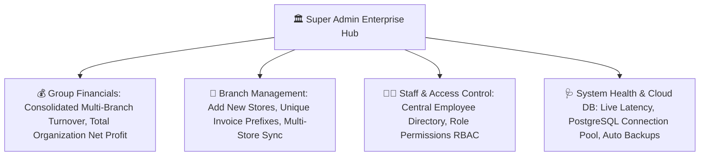

# 🏛️ Complete Buyer's Guide & Manual: Super Admin Enterprise Control Center (`/super-admin`)

> **Target Audience:** Pharmacy Chain Owners, Group Directors, Managing Partners, and Enterprise Software Buyers.

---

## 🌟 1. Executive Summary: Managing Your Entire Pharmacy Empire from One Screen

Jab aapka business 1 dukan se badh kar 2, 5 ya 10 pharmacy branches ban jata hai, to dukan par roz baithna namumkin ho jata hai:
- *Branch-1 me kitni sale hui aur Branch-2 me kitni sale hui?*
- *Kahi Branch-3 ka manager unauthorized discount to nahi de raha?*
- *Overall group ka profit kitna ban raha hai?*

**MedCare Super Admin Control Center** enterprise pharmacy owners ke liye banaya gaya supreme governance hub hai. Yeh alag-alag shaheron ya ilaqon me chal rahi saari branches ka data ek sath consolidate karta hai, live performance comparisons dikhata hai, aur central policy controls provide karta hai.

---

## 📊 2. Enterprise Governance & Analytics Grid

---

## 🏬 3. Multi-Branch Real-Time Comparison Table

Control Center me har branch ka side-by-side performance audit hota hai:

| Branch Name & Code | Today's Gross Sales | Today's Net Profit | Active Cash Float | Low Stock Alerts | Performance Status |
|---|---|---|---|---|---|
| **`MAIN-01 · Main Dispensary`** | ₹14,250.00 | ₹3,420.00 (24%) | ₹6,207.36 | 2 Items | 🟢 High Performing |
| **`BRANCH-02 · City Hospital Branch`** | ₹28,900.00 | ₹6,936.00 (24%) | ₹12,450.00 | 5 Items | 🟢 Star Branch |
| **`BRANCH-03 · Metro Station Clinic`** | ₹4,800.00 | ₹1,056.00 (22%) | ₹3,100.00 | 0 Items | 🟡 Average Velocity |
| **🏢 TOTAL CONSOLIDATED** | **₹47,950.00** | **₹11,412.00 (23.8%)** | **₹21,757.36** | **7 Alerts** | **🚀 Healthy Enterprise** |

---

## 🔐 4. Centralized Security & Policy Enforcements

1. **Global Drug Price Master:** Owner chahe to Main Branch se selling rate set karega aur saari branches me wahi standard rate chalega.
2. **Universal Password Reset:** Kisi bhi staff ka password 1 second me centrally reset kiya ja sakta hai.
3. **Emergency Store Lockout:** Agar kisi branch me sandigdh activity dikhe, to Super Admin 1-click me us branch ke POS counters ko temporarily freeze kar sakta hai.

---

## ❓ 5. Buyer FAQs

**Q1: Kya hum phone ya iPad par baith kar Super Admin dekh sakte hain?**
* **Ans:** Haan! MedCare 100% responsive web architecture par bana hai; aap world me kahin se bhi apne smartphone par live Super Admin panel open kar sakte hain.

**Q2: Agar koi branch internet se disconnect ho jaye to kya hota hai?**
* **Ans:** System connection status monitor karta hai aur reconnect hote hi local transactions cloud database se auto-sync ho jate hain.
