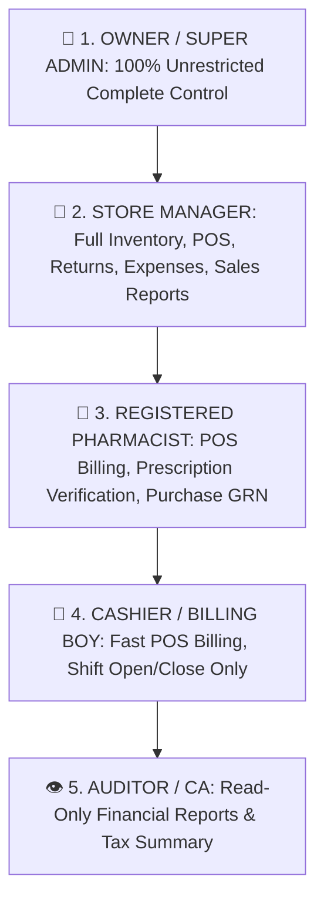

# 👨‍💼 Complete Buyer's Guide & Manual: Staff Directory & Granular RBAC Permissions (`/super-admin/staff`)

> **Target Audience:** Pharmacy Owners, HR Heads, Managing Directors, and Software Buyers.

---

## 🌟 1. Executive Summary: Granular Security for Peace of Mind

Pharmacy me har staff member ka alag role aur alag responsibility hoti hai:
- *Billing boy (Cashier) ko sirf bill banana aur shift close karna chahiye.*
- *Registered Pharmacist ko doctor ka prescription check karna aur distributor ka stock chadhana chahiye.*
- *Store Manager ko stock transfer aur returns handle karna chahiye.*
- *Lekin dukan ka total profit, supplier purchase rates, aur database settings sirf aur sirf Owner (Super Admin) ke paas honi chahiye!*

Agar software me har staff ko sab kuch karne ki permission mil jaye:
- *Cashier purchase rate dekh kar customer ko saste daam me dawa de dega.*
- *Staff reports me jakar owner ka daily profit dekh kar market me afwah phailayega.*
- *Galti se koi purane bills delete kar dega.*

**MedCare Staff Directory & Granular RBAC (Role-Based Access Control) System** aapke pure staff par 100% disciplined, secure control deta hai. Har employee ko uske role ke mutabiq exact permissions milti hain.

---

## 🛡️ 2. The 5-Tier Role & Permission Hierarchy Matrix

---

### Detailed Permission Matrix Table:

| Feature / Screen | `CASHIER` | `PHARMACIST` | `STORE_MANAGER` | `OWNER / ADMIN` |
|---|---|---|---|---|
| **POS Billing (`/pos`)** | ✅ Full Access | ✅ Full Access | ✅ Full Access | ✅ Full Access |
| **Shift Management (`/cash-register`)** | ✅ Own Shift Only | ✅ Own Shift Only | ✅ All Shifts | ✅ Full Audit |
| **Sales Returns (`/sales-returns`)** | ❌ Blocked | ✅ Create Return | ✅ Approve Return | ✅ Full Access |
| **Medicine Master Catalog (`/medicines`)** | 👁️ View Only | ✅ Add/Edit Salt | ✅ Full Access | ✅ Full Access |
| **Purchase Inward GRN (`/purchases`)** | ❌ Blocked | ✅ Receive Goods | ✅ Full Access | ✅ Full Access |
| **Inter-Branch Transfer (`/stock-transfers`)**| ❌ Blocked | ❌ Blocked | ✅ Full Access | ✅ Full Access |
| **Daily Expenses (`/expenses`)** | ❌ Blocked | ❌ Blocked | ✅ Create Expense | ✅ Full Access |
| **Profit & Loss Analytics (`/reports`)** | ❌ **Strictly Blocked**| ❌ **Strictly Blocked**| 👁️ Sales Only (No Profit)| ✅ **Full Profit & P&L** |
| **Store Settings & Themes (`/settings`)** | ❌ Blocked | ❌ Blocked | ❌ Blocked | ✅ Full Access |
| **Branch & Staff Management (`/super-admin`)**| ❌ Blocked | ❌ Blocked | ❌ Blocked | ✅ Full Access |

---

## 🔐 3. User Creation & Branch Association

Naya staff member jodte waqt:
1. **Full Name & Login Credentials:** Staff Name, Email/Username, aur Encrypted Password (bcrypt salted 10 rounds).
2. **Branch Assignment:** Staff ko specific branch assign ki jati hai (e.g. `Ramesh` sirf `MAIN-01` me login kar sakta hai, `BRANCH-02` me unauthorized access blocked hoga).
3. **Role Tagging:** Multiple roles assign kiye ja sakte hain (jaise `PHARMACIST + CASHIER`).
4. **Instant Deactivation:** Agar koi staff naukri chhod deta hai, to 1 click me uska account **`Inactive`** kiya ja sakta hai aur wo turant system se logout ho jata hai!

---

## ❓ 4. Buyer FAQs

**Q1: Kya hum cashier ko discount dene se rok sakte hain?**
* **Ans:** Haan! RBAC me "Max Allowed Discount %" rule set kiya ja sakta hai (e.g. Cashier max 5% discount de sakta hai, usse upar Manager approval lagega).

**Q2: Agar staff apna password bhool jaye to?**
* **Ans:** Super Admin 1-click me staff profile me jakar naya password generate kar sakta hai.
