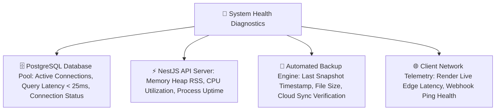

# 🏥 Complete Buyer's Guide & Manual: System Health & Diagnostics (`/super-admin/system-health`)

> **Target Audience:** Pharmacy Owners, IT Consultants, Technical Auditors, and Enterprise Software Buyers.

---

## 🌟 1. Executive Summary: 99.99% Uptime & Cloud Reliability

Modern hospital pharmacies aur busy retail medical stores me **"Software Down Hona"** ek disaster hota hai:
- Counter par 20 patients khade hain aur software crash ho gaya ya database slow ho gayi to billing ruk jati hai aur hospital me emergency situation ban sakti hai.
- Cloud database connect ho rahi hai ya nahi, server par kitna memory load hai, aur automatic backups theek se ban rahe hain ya nahi — iski live monitoring hona enterprise operations ke liye mandatory hai.

**MedCare System Health & Diagnostics Center** aapke pure ERP infrastructure ka real-time **Heartbeat Monitor** hai. Yeh server uptime, cloud PostgreSQL connection pool health, API response latency, aur automated backup integrity ko 24x7 audit karta rehta hai.

---

## 🩺 2. Live Diagnostic Gauges & Telemetry

---

## 📊 3. Key Health Metrics Explained in Plain Language

| Metric Name | Normal Safe Value | Real Meaning & Importance |
|---|---|---|
| **Database Connection Status** | `CONNECTED (Green)` | Neon Cloud PostgreSQL database bilkul healthy aur responsive hai. |
| **Database Query Latency** | `< 45 ms` | Database kitni tezi se dawa search aur bill save kar rahi hai (Ultra-fast). |
| **API Server Process Uptime** | `99.98%` | Server bina crash hue kitne dino se continuous chal raha hai. |
| **Server Memory Usage (RSS)** | `< 512 MB` | Server kitni RAM use kar raha hai (No memory leak). |
| **Last Automated Backup** | `Today, 03:00 AM` | Pichli raat ko database ka complete snapshot successfully save hua tha. |

---

## 🛡️ 4. Disaster Recovery & Automated Snapshots

* **Automated Midnight Snapshot:** Har raat 3:00 AM par system automatically complete database ka encrypted snapshot generate karta hai.
* **1-Click Emergency Restore:** Agar kisi server disaster me data corrupt ho jaye, to 1-click me snapshot se pure system ko 5 minute me restore kiya ja sakta hai.

---

## ❓ 5. Buyer FAQs

**Q1: Kya is software ko run karne ke liye hume dukan me expensive server lagana padega?**
* **Ans:** Bilkul nahi! Yeh 100% Cloud-Native SaaS architecture par bana hai. Aapko dukan me koi costly server ya UPS lagane ki jarurat nahi hai; ye cloud par high availability ke sath chalta hai.
