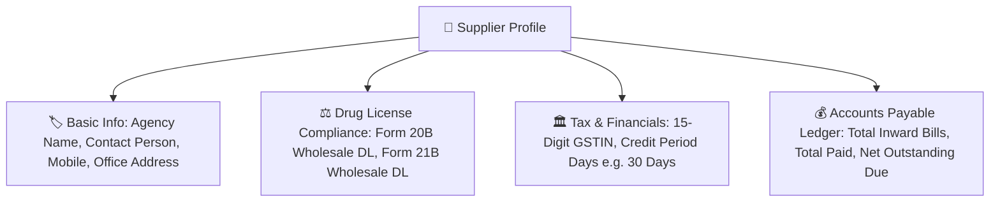

# 🏢 Complete Buyer's Guide & Manual: Suppliers & Distributor Accounts Payable (`/suppliers`)

> **Target Audience:** Medical Store Owners, Accounts Heads, Purchasing Executives, and Software Buyers.

---

## 🌟 1. Executive Summary: Master Your Distributor Relationships

Ek average retail pharmacy 20 se 50 alag-alag wholesale distributors, C&F agents, aur direct pharma companies se maal kharidti hai (jaise: Mankind Agency, Sun Pharma C&F, Abbott Distributor, Surgical Agency, Ayurvedic Stockist).

Har distributor ki alag terms hoti hain:
- *Mankind Agency 21 din ka credit deta hai aur 21 din me cheque chahiye.*
- *Cipla Distributor 30 din ka credit deta hai lekin 7 din me pay karne par 2% extra cash discount (CD) deta hai.*
- *Agar hisab dairy ya purane software me uljha ho, to distributor ke agent aakar bolte hain: "Sir aapke ₹75,000 baki hain", jabki aapke hisab se ₹50,000 hone chahiye the!*

**MedCare Suppliers & Accounts Payable Module** aapki pharmacy aur distributors ke beech ke hisab ko bilkul transparent aur crystal-clear banata hai. Yeh har distributor ke Drug License (Form 20B/21B), GSTIN, purchase bills, payment vouchers, aur outstanding credit balance ko real-time track karta hai.

---

## 📋 2. Supplier Master Profile & Regulatory Fields

---

## 📑 3. Core Supplier Ledger Metrics

Supplier list me har vendor ke aage 4 clear financial numbers dikhte hain:

| Ledger Metric | Meaning & Calculation |
|---|---|
| **Total Inward Purchases** | Subah se lekar aaj tak is distributor se kitne total rupaye ka maal kharida gaya. |
| **Total Payments Made** | Bank NEFT, Cheque, UPI ya Cash se is vendor ko kitni payment di ja chuki hai. |
| **Credit Notes (Returns/Expiry)** | Dawa wapas karne ya expiry claim se distributor ne kitna rupaya maaf/credit kiya. |
| **🎯 Net Outstanding Balance** | $\text{Total Purchases} - \text{Total Payments} - \text{Credit Notes} = \mathbf{Distributor\ Ko\ Kitna\ Dena\ Hai}$ |

---

## 💵 4. Recording Supplier Payment Vouchers

Jab aap distributor ko payment dete hain:
1. Supplier search karein (e.g. `Mankind Agency`).
2. **"Record Payment Voucher"** button par click karein.
3. Payment Details bharein:
   - Amount: `₹25,000.00`
   - Payment Mode: `BANK_NEFT` / `CHEQUE` / `UPI` / `CASH`
   - Reference / UTR Number: `NEFT-2026-98124`
   - Notes: `Against Invoice MP-8941 & MP-8942`
4. Submit karte hi vendor ke outstanding ledger se ₹25,000 minus ho jata hai aur formal **Payment Voucher Receipt** download ke liye ready ho jati hai!

---

## 🛡️ 5. Regulatory Drug License (DL) & GSTIN Validation

* **Drug Inspector Compliance:** Kisi bhi aise person ya dukan se dawai khareedna gair-kanooni hai jiske paas valid Wholesale Drug License (Form 20B/21B) na ho.
* **MedCare Safety Feature:** Supplier add karte waqt software DL numbers aur GSTIN format ko validate karta hai.
* **GST ITC Reconciliation:** Purchase bills par distributor ka GSTIN save hone ki wajah se aapka accountant monthly GSTR-2B me 100% tax credit match kar sakta hai.

---

## ❓ 6. Buyer FAQs

**Q1: Kya hum dekh sakte hain ki agle 7 dino me kis-kis distributor ko payment karni hai?**
* **Ans:** Haan! Reports section me **"Upcoming Supplier Payables Radar"** hai jo payment due date ke hisab se alerts dikhata hai taki aapka cheque bounce na ho.

**Q2: Agar distributor ne expiry dawa ka Credit Note diya to usko kaise adjust karein?**
* **Ans:** Supplier ledger me "Add Credit Note" option hai jo outstanding bill balance me se credit amount ko automatic deduct kar deta hai.
