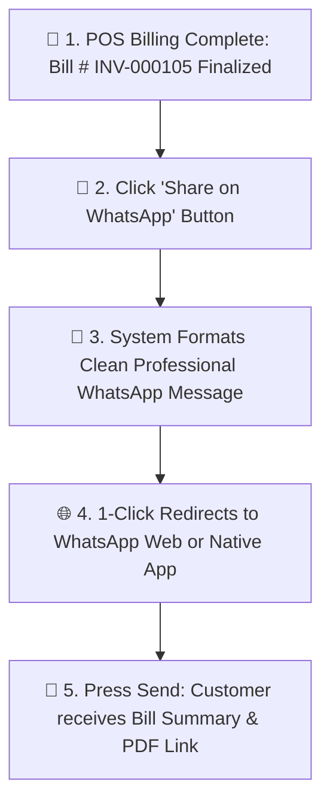

# 💬 Complete Buyer's Guide & Manual: WhatsApp Web Quick Share & Zero-Cost Digital Bills (`/whatsapp`)

> **Target Audience:** Pharmacy Owners, Cashiers, Customer Relationship Managers, and Software Buyers.

---

## 🌟 1. Executive Summary: The Modern Paperless Pharmacy

Aaj kal har customer ke haath me smartphone hai aur log paper receipt (kaghaz ka bill) sambhal kar rakhne ki jagah **WhatsApp par digital bill** mangte hain.
- Paper thermal rolls har mahine ₹2,000 se ₹5,000 ka extra kharcha khate hain.
- Kaghaz ka bill 2 mahine baad feeka (fade) pad jata hai jisse insurance claim me pareshani aati hai.
- Third-party WhatsApp SMS gateways har message ka ₹0.50 se ₹1.00 charge karte hain aur unme monthly DLT registration aur monthly subscription fees deni padti hai.

**MedCare Zero-Cost WhatsApp Web Integration** aapko bina kisi third-party API, bina kisi monthly recharge, aur bina kisi DLT approval ke **100% Free WhatsApp Digital Bills & Payment Reminders** bhejne ki suvidha deta hai!

---

## 🚀 2. How the Click-to-Chat Flow Works (Zero API Cost Architecture)



---

## 📲 3. Sample WhatsApp Formatted Message (What the Patient Receives)

System automatically ek neat, professional message compose karta hai jisme pharmacy ka brand aur bill summary hoti hai:

```text
🏥 *MEDCARE PHARMACY & HEALTHCARE*
📍 12, Hospital Road, Civil Lines
📞 Phone: +91 98765 43210
══════════════════════════════
🧾 *TAX INVOICE / CASH MEMO*
Invoice No: *MAIN-000105*
Date & Time: 26 Aug 2026, 11:45 AM
Cashier: Ramesh Kumar
══════════════════════════════
👤 *Patient Details:*
Name: Rajesh Kumar
Mobile: +91 98123 45678

📋 *Itemized Summary:*
1. Augmentin 625 Duo (10 Tabs) - ₹200.00
2. Pan-D Capsule (15 Caps) - ₹195.00
3. Dolo 650 Tablet (15 Tabs) - ₹33.00
──────────────────────────────
Gross Subtotal: ₹428.00
Discounts: -₹0.00
Round Off: -₹0.00
*NET PAYABLE: ₹428.00*
*PAYMENT STATUS: PAID (CASH)*
══════════════════════════════
📄 *View / Download Digital PDF Receipt:*
👉 https://medcare.com/receipt/MAIN-000105

💊 *Dosage Instructions:* Please take medicines as prescribed by your registered medical practitioner.

🙏 *Get well soon! Thank you for choosing MedCare.*
```

---

## 🔔 4. Automated Credit Khata Payment Reminders via WhatsApp

Agar kisi regular customer ka udhar (credit balance) baaki hai:
1. Customer Directory me jakar **"Send Payment Reminder"** par click karein.
2. WhatsApp me pre-filled message khulta hai:
   ```text
   Namaste Sharma Ji 🙏
   Aapka MedCare Pharmacy par kul baki balance *₹1,800.00* hai.
   Aap niche diye gaye UPI QR code par GooglePay / PhonePe se payment kar sakte hain:
   UPI ID: medcare@upi
   Dhanyawad!
   ```
3. Customer bina kisi jhagde ke turant ghar baithe online payment kar deta hai!

---

## 🛡️ 5. Privacy & Zero Data Leak Guarantee

* **No WhatsApp Login Token on Server:** Hum aapka personal WhatsApp account kisi server par connect nahi karte. Yeh official browser URL schema (`https://web.whatsapp.com/send?phone=...`) ke zariye seedhe aapke browser me khulta hai.
* **100% Account Safety:** Aapka WhatsApp number kabhi spam ya third-party blocking me nahi fas sakta.

---

## ❓ 6. Buyer FAQs

**Q1: Kya iske liye koi monthly WhatsApp API charges dene honge?**
* **Ans:** Bilkul ₹0! Yeh zero-cost redirect architecture par chalta hai aur lifetime free hai.

**Q2: Agar hum tablet ya mobile use kar rahe hain to kya yeh WhatsApp App kholega?**
* **Ans:** Haan! Mobile aur tablet par yeh automatic native WhatsApp Application open karta hai aur Desktop par WhatsApp Web open karta hai.
